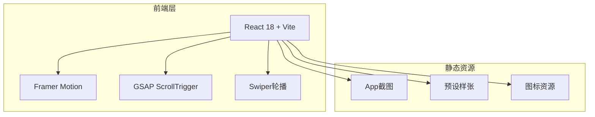

# OMaster App功能展示网站 - 技术架构文档

## 1. 架构设计



## 2. 技术描述

- **前端**: React@18 + TypeScript + TailwindCSS@3 + Vite@5
- **动画**: Framer Motion + GSAP ScrollTrigger
- **轮播**: Swiper
- **图标**: Lucide React
- **字体**: Google Fonts (Noto Sans SC)
- **初始化工具**: create-vite

## 3. 路由定义

| 路由 | 用途 |
|-----|------|
| / | 单页展示网站 |

## 4. 项目结构

```
omaster-showcase/
├── src/
│   ├── sections/        # 页面区块组件
│   │   ├── Hero.tsx
│   │   ├── Features.tsx
│   │   ├── Gallery.tsx
│   │   ├── Preview.tsx
│   │   ├── Testimonials.tsx
│   │   └── Download.tsx
│   ├── components/      # 公共组件
│   │   ├── Navbar.tsx
│   │   ├── Footer.tsx
│   │   ├── FeatureCard.tsx
│   │   └── GalleryItem.tsx
│   ├── hooks/           # 自定义Hooks
│   │   └── useScrollAnimation.ts
│   ├── App.tsx
│   ├── main.tsx
│   └── index.css
├── public/              # 静态资源
│   ├── screenshots/
│   ├── presets/
│   └── icons/
├── index.html
├── package.json
├── vite.config.ts
└── tailwind.config.js
```

## 5. 数据模型

### 5.1 功能特性
```typescript
interface Feature {
  id: string;
  icon: string;
  title: string;
  description: string;
  color: string;
}
```

### 5.2 预设样张
```typescript
interface PresetSample {
  id: string;
  name: string;
  author: string;
  image: string;
  tags: string[];
  beforeImage?: string;
  afterImage: string;
}
```

### 5.3 用户评价
```typescript
interface Testimonial {
  id: string;
  name: string;
  avatar: string;
  rating: number;
  content: string;
  date: string;
}
```

## 6. 动画规划

| 元素 | 动画类型 | 触发方式 |
|-----|---------|---------|
| Hero手机 | 浮动动画 | 自动循环 |
| Hero标题 | 文字渐入 | 页面加载 |
| 功能卡片 | 淡入上浮 | 滚动进入视口 |
| 预设图片 | 悬停放大 | 鼠标悬停 |
| 轮播切换 | 3D透视 | 自动/手动 |
| 下载按钮 | 发光脉冲 | 悬停 |
