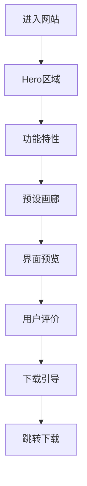

# OMaster App功能展示网站 - 产品需求文档

## 1. 产品概述
为OMaster摄影调色参数管理App创建的功能展示网站，通过精美的Web界面展示App的核心功能和特色，吸引用户下载使用。
- 面向摄影爱好者和手机摄影用户，展示App的专业性和易用性
- 提升品牌认知度，促进应用下载转化

## 2. 核心功能

### 2.1 功能模块
1. **Hero区域**: 震撼的首屏展示、应用截图、下载按钮
2. **功能特性**: 6大核心功能的详细介绍和动画展示
3. **预设展示**: 精选预设样张画廊、悬停效果
4. **界面预览**: App界面截图轮播、交互演示
5. **用户评价**: 用户好评展示、星级评分
6. **下载引导**: 多平台下载入口、二维码

### 2.2 页面详情
| 页面名称 | 模块名称 | 功能描述 |
|---------|---------|---------|
| Hero | 首屏展示 | 全屏背景、动态标题、应用截图浮动动画 |
| Hero | 下载按钮 | GitHub/国内镜像双入口、版本信息 |
| 功能特性 | 预设库 | 23+专业预设、分类标签展示 |
| 功能特性 | 云同步 | 实时更新、自定义源说明 |
| 功能特性 | 悬浮窗 | 拍照时参数悬浮展示说明 |
| 功能特性 | 收藏管理 | 本地存储、快速访问 |
| 功能特性 | 多平台 | 各大品牌相机支持 |
| 功能特性 | 简洁界面 | 纯黑背景、品牌配色展示 |
| 预设画廊 | 样张展示 | 瀑布流布局、悬停放大效果 |
| 界面预览 | 截图轮播 | 自动播放、手动切换 |
| 用户评价 | 好评卡片 | 用户头像、评分、评语 |
| 下载区 | 下载入口 | GitHub/蒲公英/蓝奏云 |

## 3. 核心流程

用户进入网站后，首先看到震撼的Hero区域，展示App的核心价值和视觉吸引力。向下滚动依次了解功能特性、预设样张、界面预览和用户评价，最终被引导至下载区域完成转化。

## 4. 用户界面设计

### 4.1 设计风格
- **主色调**: 纯黑背景 #0D1117，哈苏橙强调色 #FF6B35
- **辅助色**: 科技蓝 #58A6FF，金色点缀 #FFD700
- **字体**: 标题使用思源黑体/Noto Sans SC，正文使用系统字体
- **布局**: 单页滚动、全屏区块、卡片式内容
- **动画**: 滚动触发动画、悬停效果、浮动动画
- **风格**: 科技感、专业摄影、高端大气

### 4.2 页面设计概述
| 页面 | 模块 | UI元素 |
|-----|------|-------|
| Hero | 首屏 | 全屏渐变背景、浮动手机Mockup、粒子效果 |
| 功能特性 | 卡片网格 | 图标+标题+描述、悬停上浮效果 |
| 预设画廊 | 瀑布流 | 图片悬停放大、标签叠加、阴影效果 |
| 界面预览 | 轮播 | 3D透视切换、指示器、自动播放 |
| 用户评价 | 卡片 | 头像、星级、评语、玻璃拟态效果 |
| 下载区 | 按钮组 | 大按钮、图标、二维码弹窗 |

### 4.3 响应式设计
- 桌面优先设计 (1920x1080)
- 平板适配 (768px+)
- 移动端优化 (375px+)
- 触摸友好的交互

### 4.4 动画效果
- Hero区域: 手机Mockup浮动动画、背景渐变流动
- 功能卡片: 滚动进入视口时淡入上浮
- 预设图片: 悬停时放大1.05倍、阴影增强
- 界面轮播: 3D透视切换效果
- 下载按钮: 悬停时发光效果
