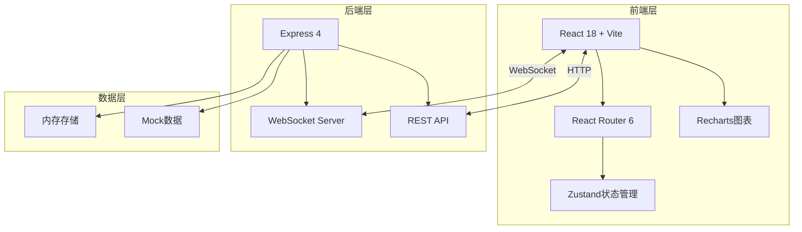

# OMaster Web调试控制台 - 技术架构文档

## 1. 架构设计



## 2. 技术描述

- **前端**: React@18 + TailwindCSS@3 + Vite@5
- **路由**: React Router DOM@6
- **状态管理**: Zustand
- **图表**: Recharts
- **代码编辑器**: Monaco Editor
- **JSON展示**: react-json-view
- **后端**: Express@4
- **实时通信**: Socket.io
- **初始化工具**: create-vite

## 3. 路由定义

| 路由 | 用途 |
|-----|------|
| / | 仪表盘首页 |
| /logs | 日志查看器 |
| /api-test | API测试工具 |
| /presets | 预设数据管理 |
| /device | 设备信息 |
| /holidays | 节日配置 |

## 4. API定义

### 4.1 系统状态 API
```typescript
GET /api/status
Response: {
  status: 'running' | 'stopped';
  uptime: number;
  memory: { used: number; total: number };
  network: { connected: boolean; latency: number };
}
```

### 4.2 日志 API
```typescript
GET /api/logs?level=&search=&limit=
Response: {
  logs: Array<{
    timestamp: string;
    level: 'DEBUG' | 'INFO' | 'WARN' | 'ERROR';
    tag: string;
    message: string;
  }>;
}

WebSocket: ws://localhost:3001/logs
实时推送日志数据
```

### 4.3 预设管理 API
```typescript
GET /api/presets
POST /api/presets
PUT /api/presets/:id
DELETE /api/presets/:id
GET /api/presets/:id
```

### 4.4 设备信息 API
```typescript
GET /api/device
Response: {
  model: string;
  androidVersion: string;
  screenResolution: string;
  density: number;
  memory: number;
  storage: number;
}
```

### 4.5 节日配置 API
```typescript
GET /api/holidays
PUT /api/holidays/:id
Response: Array<Holiday>
```

## 5. 数据模型

### 5.1 日志条目
```typescript
interface LogEntry {
  id: string;
  timestamp: number;
  level: 'DEBUG' | 'INFO' | 'WARN' | 'ERROR';
  tag: string;
  message: string;
  stackTrace?: string;
}
```

### 5.2 预设数据
```typescript
interface Preset {
  id: string;
  name: string;
  author: string;
  description: string;
  coverUrl: string;
  params: CameraParams;
  tags: string[];
  rating: number;
  downloadCount: number;
  isNew: boolean;
  createdAt: string;
}
```

### 5.3 设备信息
```typescript
interface DeviceInfo {
  model: string;
  manufacturer: string;
  androidVersion: string;
  sdkVersion: number;
  screenWidth: number;
  screenHeight: number;
  density: number;
  totalMemory: number;
  availableMemory: number;
  totalStorage: number;
  availableStorage: number;
}
```

## 6. 项目结构

```
web-debug/
├── src/
│   ├── components/       # 公共组件
│   │   ├── Layout.tsx
│   │   ├── Sidebar.tsx
│   │   ├── Header.tsx
│   │   ├── Card.tsx
│   │   └── Toast.tsx
│   ├── pages/           # 页面组件
│   │   ├── Dashboard.tsx
│   │   ├── Logs.tsx
│   │   ├── ApiTest.tsx
│   │   ├── Presets.tsx
│   │   ├── Device.tsx
│   │   └── Holidays.tsx
│   ├── hooks/           # 自定义Hooks
│   │   ├── useWebSocket.ts
│   │   ├── useLogs.ts
│   │   └── useApi.ts
│   ├── store/           # 状态管理
│   │   └── index.ts
│   ├── types/           # TypeScript类型
│   │   └── index.ts
│   ├── utils/           # 工具函数
│   │   └── format.ts
│   ├── App.tsx
│   ├── main.tsx
│   └── index.css
├── server/              # 后端服务
│   ├── index.js
│   ├── routes/
│   │   ├── status.js
│   │   ├── logs.js
│   │   ├── presets.js
│   │   ├── device.js
│   │   └── holidays.js
│   └── mock/
│       └── data.js
├── index.html
├── package.json
├── vite.config.ts
└── tailwind.config.js
```
