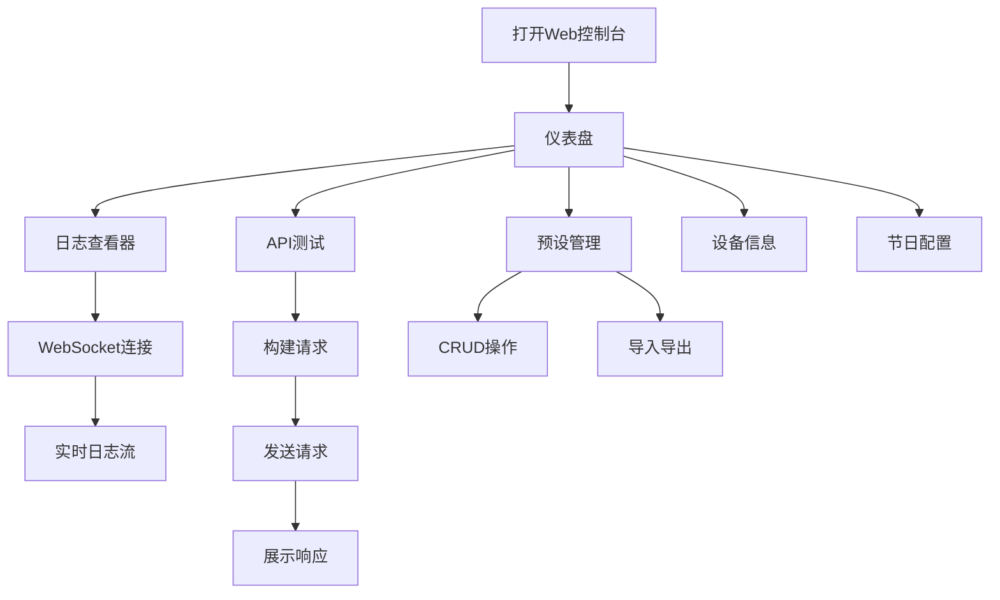

# OMaster Web调试控制台 - 产品需求文档

## 1. 产品概述
为OMaster Android应用创建的Web调试控制台，通过浏览器界面实时监控应用状态、查看日志、测试API、管理预设数据。
- 解决Android应用调试不便的问题，提供可视化调试界面
- 面向开发者和测试人员，提升调试效率

## 2. 核心功能

### 2.1 功能模块
1. **仪表盘**: 实时状态监控、关键指标展示
2. **日志查看器**: 实时日志流、级别筛选、关键字搜索
3. **API测试工具**: 接口测试、参数编辑、响应查看
4. **预设数据管理**: 预设CRUD、导入导出、批量操作
5. **设备信息**: 连接设备信息、系统状态、性能监控
6. **节日配置**: 节日问候系统配置、预览

### 2.2 页面详情
| 页面名称 | 模块名称 | 功能描述 |
|---------|---------|---------|
| 仪表盘 | 状态卡片 | 显示应用运行状态、内存使用、网络状态 |
| 仪表盘 | 图表区域 | 实时性能曲线图、请求量统计 |
| 日志查看器 | 日志流 | WebSocket实时日志推送、自动滚动 |
| 日志查看器 | 筛选器 | 按级别(DEBUG/INFO/WARN/ERROR)筛选 |
| API测试 | 请求构建 | 方法选择、URL输入、参数编辑、Headers编辑 |
| API测试 | 响应展示 | JSON格式化、状态码显示、耗时统计 |
| 预设管理 | 数据表格 | 预设列表、分页、排序、搜索 |
| 预设管理 | 编辑器 | 预设JSON编辑、实时预览、保存 |
| 设备信息 | 信息面板 | 设备型号、Android版本、屏幕信息 |
| 节日配置 | 节日列表 | 所有节日配置、开关控制 |
| 节日配置 | 预览弹窗 | 节日问候弹窗实时预览 |

## 3. 核心流程

用户打开Web调试控制台后，首先看到仪表盘页面，展示应用的实时运行状态。通过左侧导航可以切换到不同功能模块：
- 日志查看器：连接WebSocket接收实时日志，支持筛选和搜索
- API测试：构建HTTP请求，发送后查看响应结果
- 预设管理：查看所有预设数据，支持增删改查和导入导出
- 设备信息：查看当前连接设备的详细信息
- 节日配置：管理节日问候系统，预览节日效果

## 4. 用户界面设计

### 4.1 设计风格
- **主色调**: 深色主题 #0D1117 (GitHub Dark)
- **强调色**: 哈苏橙 #FF6B35
- **辅助色**: 科技蓝 #58A6FF
- **字体**: JetBrains Mono (代码), Inter (UI)
- **布局**: 左侧固定导航 + 右侧内容区
- **卡片**: 圆角12px, 轻微阴影, 边框1px #30363D
- **动画**: 平滑过渡 200ms, 悬停效果

### 4.2 页面设计概述
| 页面 | 模块 | UI元素 |
|-----|------|-------|
| 仪表盘 | 状态卡片 | 玻璃拟态效果、实时数字动画 |
| 仪表盘 | 性能图表 | 深色主题Chart.js、渐变填充 |
| 日志查看器 | 日志列表 | 语法高亮、可折叠堆栈 |
| API测试 | 请求面板 | 标签页切换、JSON编辑器 |
| 预设管理 | 数据表格 | 行内编辑、图片预览 |
| 节日配置 | 预览弹窗 | 模态框、渐变背景 |

### 4.3 响应式设计
- 桌面优先设计 (1920x1080)
- 平板适配 (768px+)
- 移动端折叠导航

### 4.4 交互细节
- 左侧导航图标 + 文字，激活状态高亮
- 表格行悬停显示操作按钮
- Toast通知提示操作结果
- 模态框打开/关闭淡入淡出动画
- 数据加载骨架屏
