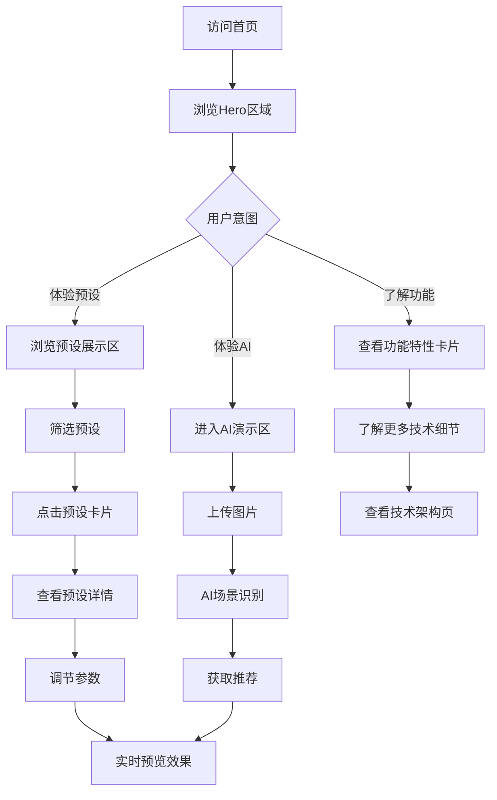

# OPPOMaster 网页版APP展示 - 产品需求文档

## 1. 产品概述

OPPOMaster是一款为OPPO哈苏影像系统设计的专业调色参数库应用。本网页版旨在提供一个精美的在线展示平台，让用户能够通过浏览器体验APP的核心功能和界面设计。

### 产品定位
- **目标用户**：摄影爱好者、OPPO手机用户、专业摄影师
- **核心价值**：展示ColorOS系统级集成、哈苏认证预设、AI智能推荐等核心功能
- **市场价值**：作为产品展示和营销的重要窗口，提升品牌影响力

---

## 2. 核心功能模块

### 2.1 用户角色（本展示平台）

| 角色 | 说明 | 权限 |
|------|------|------|
| 访客用户 | 普通网页访问者 | 浏览展示内容，体验交互功能 |

### 2.2 功能模块清单

1. **首页展示**
   - 品牌Hero区域
   - 核心功能特性展示
   - 预设卡片瀑布流展示
   - AI智能推荐演示区

2. **预设详情页**
   - 高清预设预览
   - 相机参数可视化展示
   - 使用场景说明
   - AI场景识别演示

3. **技术特性页**
   - 架构设计展示
   - AI能力演示
   - 实时预览体验区

4. **关于我们**
   - 品牌故事
   - 团队介绍
   - 联系方式

### 2.3 页面功能详情

| 页面名称 | 模块名称 | 功能描述 |
|---------|---------|----------|
| 首页 | Hero区域 | 全屏品牌展示，动态背景，核心卖点强调 |
| 首页 | 功能特性 | 六大核心功能卡片式展示，图标动画 |
| 首页 | 预设展示 | 可交互的预设卡片，筛选和搜索功能 |
| 首页 | AI演示区 | 拖拽图片进行AI场景识别演示 |
| 详情页 | 预设预览 | 大图展示，参数图表，可视化调节 |
| 详情页 | 参数面板 | 专业相机参数展示，交互式调节 |
| 技术页 | 架构图 | 动态技术架构展示 |
| 技术页 | 功能演示 | 实时预览、图像处理等交互演示 |
| 关于页 | 品牌故事 | 时间轴展示品牌发展历程 |
| 关于页 | 团队 | 成员卡片展示 |

---

## 3. 核心交互流程

### 3.1 主要用户流程

**浏览流程**
1. 用户进入首页 → 浏览Hero区域 → 了解核心功能
2. 浏览预设卡片 → 点击卡片 → 进入详情页
3. 在详情页体验参数调节 → 预览效果
4. 查看技术特性 → 了解产品技术实力
5. 浏览关于我们 → 了解品牌故事

**AI演示流程**
1. 用户在首页点击"立即体验" → 进入AI演示区
2. 上传或选择示例图片 → AI自动识别场景
3. 查看识别结果 → 获取推荐预设
4. 应用预设 → 查看处理效果

**预设体验流程**
1. 用户浏览预设卡片
2. 使用筛选功能（HNCS、设备类型、风格）
3. 点击卡片进入详情
4. 调节参数滑块
5. 实时查看预览效果
6. 收藏或分享预设

### 3.2 流程图

---

## 4. 用户界面设计

### 4.1 设计风格

**设计理念**
- 采用ColorOS 16 Aqua Design水生设计语言
- 融合哈苏专业摄影美学
- 现代化、科技感、专业性

**主色调**
- **哈苏橙** `#D4A574` - 品牌主色，用于强调和按钮
- **OPPO绿** `#00C853` - 点缀色，用于成功状态
- **深海黑** `#121212` - 深色主题背景
- **星空白** `#FAFAFA` - 浅色主题背景

**字体选择**
- **标题字体**：思源黑体 (Source Han Sans CN) - Bold
- **正文字体**：Inter - Regular
- **数字字体**：SF Pro Display - Medium
- **品牌字体**：Hasselblad官方字体风格

**按钮样式**
- 圆角按钮 (border-radius: 12px)
- 毛玻璃效果
- 阴影：0 4px 12px rgba(0,0,0,0.1)
- 悬停：上浮 + 阴影加深

**布局风格**
- 卡片式布局
- 响应式网格系统
- 瀑布流展示
- 分屏对比布局

**图标风格**
- Material Design Icons
- 线性图标为主
- 统一 stroke-width: 2px

### 4.2 页面设计概览

#### 首页Hero区域
- **布局**：全屏，高度100vh
- **元素**：
  - 品牌Logo（带动画）
  - 主标题（渐变文字）
  - 副标题（打字机效果）
  - CTA按钮（脉冲动画）
  - 背景：动态粒子或渐变光效
- **颜色**：
  - 背景：深色渐变 #121212 → #1E1E1E
  - 文字：白色 #FFFFFF
  - 强调：哈苏橙 #D4A574
- **动画**：
  - Logo入场动画（缩放+淡入）
  - 文字逐字显示
  - 背景微光流动
  - CTA按钮脉冲呼吸

#### 功能特性卡片
- **布局**：3列网格（桌面）/ 1列（移动端）
- **元素**：
  - 功能图标（64x64px）
  - 功能标题
  - 功能描述
  - 装饰图形
- **交互**：
  - 悬停：卡片上浮、图标放大
  - 点击：展开详情面板

#### 预设展示区
- **布局**：瀑布流网格
- **元素**：
  - 预设封面图
  - HNCS认证标签
  - 预设名称
  - 设备型号
  - 收藏按钮
- **交互**：
  - 悬停：显示收藏按钮
  - 点击：打开详情弹窗
  - 筛选：顶部标签栏

#### AI演示区
- **布局**：左右分屏
- **元素**：
  - 拖拽上传区域
  - 示例图片选择
  - 识别结果展示
  - 推荐预设列表
- **颜色**：
  - 上传区边框：虚线 #D4A574
  - 结果区背景：#1E1E1E

#### 预设详情页
- **布局**：全宽图片 + 右侧参数面板
- **元素**：
  - 大图预览（可缩放）
  - 参数滑块组
  - 相机参数表
  - 操作按钮组
- **交互**：
  - 滑块调节：实时预览
  - 图片缩放：双指或滚轮
  - 保存：收藏到本地

### 4.3 响应式设计

**桌面端（> 1200px）**
- 3-4列网格
- 完整侧边栏
- 大尺寸卡片

**平板端（768px - 1200px）**
- 2列网格
- 折叠侧边栏
- 中等尺寸卡片

**移动端（< 768px）**
- 单列布局
- 底部导航
- 全屏卡片

### 4.4 特殊效果指导

**3D场景元素**
- 使用CSS 3D transforms创建卡片悬浮效果
- 背景：深色渐变 + 噪点纹理
- 光照：模拟自然光效果
- 交互：鼠标跟随视差

**动效设计**
- 入场动画：staggered reveal，间隔100ms
- 悬停效果：transform scale(1.02)，200ms ease
- 页面切换：fade + slide，300ms
- 加载状态：骨架屏 + 渐变动画

---

## 5. 产品成功指标

### 5.1 业务指标

| 指标 | 目标值 | 说明 |
|------|--------|------|
| 页面访问量 | > 10,000 PV/月 | 衡量曝光度 |
| 平均停留时长 | > 3分钟 | 衡量内容吸引力 |
| 预设点击率 | > 15% | 衡量交互参与度 |
| AI演示使用率 | > 10% | 衡量功能吸引力 |

### 5.2 技术指标

| 指标 | 目标值 | 说明 |
|------|--------|------|
| 首屏加载时间 | < 2秒 | 性能要求 |
| 交互响应时间 | < 100ms | 流畅体验 |
| 动画帧率 | > 60fps | 视觉效果 |
| 浏览器兼容性 | Chrome/Firefox/Safari/Edge | 覆盖主流 |

---

## 6. 项目约束

### 6.1 技术约束

- 纯前端实现，无需后端服务器
- 支持现代浏览器（Chrome 90+, Firefox 88+, Safari 14+, Edge 90+）
- 图片使用WebP格式，优化加载速度
- 代码体积 < 500KB（gzip）

### 6.2 设计约束

- 保持与原生APP一致的视觉风格
- 遵循ColorOS 16设计语言
- 融入哈苏品牌元素
- 适配多种屏幕尺寸

---

*文档版本：1.0*
*创建时间：2024年*
*最后更新：2024年*
