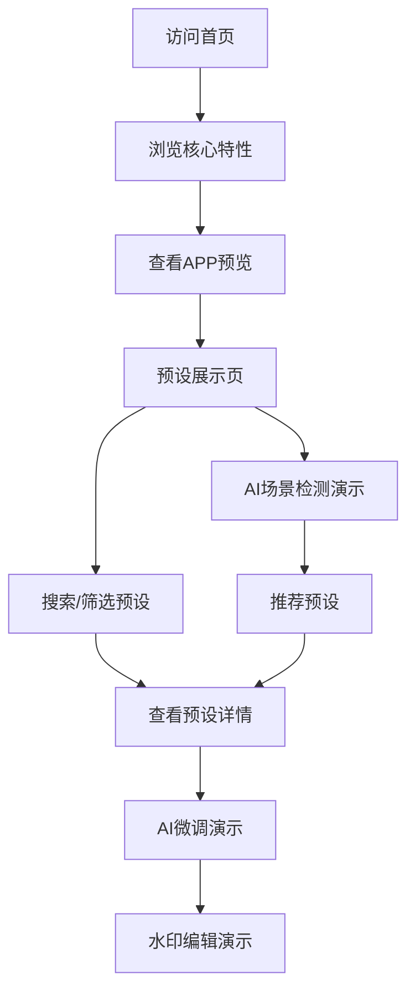

# OMaster APP Web展示 - 产品需求文档

## 1. 产品概述

OMaster 是一款面向 OPPO/一加/真我用户的哈苏相机预设与AI摄影辅助APP，本Web项目为该APP的Web端展示页，用于产品演示、品牌宣传和功能预览。

- 目标用户：摄影爱好者、OPPO设备用户、哈苏色彩科学追随者
- 核心价值：通过Web页面直观展示APP的核心功能与设计美学

## 2. 核心功能

### 2.1 用户角色

| 角色 | 访问方式 | 核心权限 |
|------|----------|----------|
| 访客 | 无需登录 | 浏览产品介绍、功能演示、UI预览 |
| 摄影爱好者 | 演示模式 | 查看预设列表、模拟AI场景检测、查看参数详情 |

### 2.2 功能模块

1. **首页**: Hero展示区、核心特性、数据统计、APP功能入口
2. **预设展示页**: 哈苏预设列表、筛选、搜索、收藏交互
3. **AI场景检测演示页**: 模拟相机预览、场景识别、推荐预设
4. **预设详情页**: 参数展示、AI微调对比、应用预设流程
5. **水印编辑演示页**: 水印定制预览、模板选择
6. **相机配置管理演示页**: 参数调整、配置导入导出

### 2.3 页面详情

| 页面名称 | 模块名称 | 功能描述 |
|---------|---------|---------|
| 首页 | Hero展示 | 全屏哈苏橙色渐变背景，展示品牌标识与核心卖点 |
| 首页 | 核心特性 | 三大核心功能卡片：哈苏预设、AI场景、专业微调 |
| 首页 | 数据统计 | 展示预设数量、用户数量、HNCS认证数量等关键数据 |
| 首页 | APP预览 | 模拟手机外壳，展示APP内主要界面 |
| 预设展示 | 预设卡片列表 | 卡片式预设展示，支持筛选（全部/收藏/HNCS/Find X/Reno/最新/热门） |
| 预设展示 | 搜索栏 | 实时搜索，支持名称/设备/标签/场景类型 |
| 预设展示 | 收藏交互 | 模拟点击收藏图标，状态持久化到localStorage |
| AI场景检测 | 相机预览 | 模拟相机取景画面，渐入动画 |
| AI场景检测 | 场景识别 | 实时显示识别场景、置信度、响应时间 |
| AI场景检测 | 推荐预设 | 显示匹配预设列表，含匹配度评分 |
| 预设详情 | 相机参数 | ISO/快门/光圈/白平衡等参数完整展示 |
| 预设详情 | AI微调对比 | 调整前/调整后参数对比表 |
| 水印编辑 | 水印预览 | 模拟相机取景画面，叠加水印效果 |
| 水印编辑 | 模板选择 | 哈苏/OPPO/一加/真我等多种模板 |
| 相机配置 | 参数调整 | ISO/快门/光圈/白平衡等参数滑块 |
| 相机配置 | 配置列表 | 已保存配置展示，支持收藏、删除 |

## 3. 核心流程

### 3.1 访客浏览流程
访客进入首页 → 浏览核心特性 → 查看APP预览 → 进入预设展示页 → 体验搜索筛选 → 查看预设详情

### 3.2 功能演示流程
用户进入AI场景检测页 → 选择示例场景 → 查看识别结果 → 浏览推荐预设 → 进入预设详情 → 查看AI微调对比

## 4. 用户界面设计

### 4.1 设计风格
- **主色调**：哈苏橙 #FF6B00、深黑 #0A0A0A
- **辅助色**：暖白 #F5F1E8、炭灰 #1C1C1E、琥珀金 #D4A574
- **强调色**：哈苏橙渐变 #FF6B00 → #FF8C42
- **按钮风格**：圆角矩形（16px圆角），悬浮态放大+阴影增强
- **字体**：英文标题用 Playfair Display（衬线、优雅），中文用 思源宋体（Source Han Serif）
- **正文字体**：Inter / 思源黑体
- **布局风格**：卡片式布局，桌面端网格3列，平板2列，手机1列
- **图标风格**：线性图标（Lucide/Phosphor），统一stroke-width: 1.5
- **动效**：进场使用staggered fade-up（间隔80ms），hover时scale(1.02)，所有过渡300ms cubic-bezier(0.4, 0, 0.2, 1)

### 4.2 页面设计概述

| 页面名称 | 模块名称 | UI元素 |
|---------|---------|--------|
| 首页 | Hero区 | 全屏高度，背景为哈苏橙色渐变网格，中央展示品牌logo与slogan，底部有向下滚动指示 |
| 首页 | 特性卡片 | 玻璃态卡片（backdrop-filter: blur），3列布局，图标+标题+描述 |
| 首页 | 数据统计 | 数字滚动动画，4列数据展示 |
| 首页 | APP预览 | 黑色手机框mockup，内部展示APP截图 |
| 预设展示 | 顶部导航 | 毛玻璃背景，包含品牌名、菜单项 |
| 预设展示 | 预设卡片 | 圆角卡片，封面图+名称+作者+评分+下载量+收藏按钮 |
| AI场景检测 | 取景器 | 黑色边框，圆角，内部为渐变背景模拟画面 |
| AI场景检测 | 识别结果 | 玻璃态卡片，显示场景名称+置信度进度条+响应时间 |
| 预设详情 | 参数表 | 等宽字体显示，参数变更前/后颜色对比 |
| 水印编辑 | 水印预览 | 模拟相机画面，右下角叠加水印 |
| 相机配置 | 参数滑块 | 自定义样式滑块，实时显示参数值 |

### 4.3 响应式设计
- 桌面优先：1280px+ 完整布局
- 平板适配：768px-1279px 网格自动降为2列
- 移动适配：<768px 单列布局，导航栏变为汉堡菜单

### 4.4 3D场景指导
- **不使用3D场景**（本项目以2D设计为主）

## 5. 技术约束

- 前端：React 18 + Vite + Tailwind CSS 3
- 路由：React Router 6
- 状态管理：Zustand（用于持久化收藏状态）
- 动画：Framer Motion（复杂动画）+ CSS Transitions（简单hover）
- 图标：Lucide React
- 字体：Google Fonts（Playfair Display + Inter）+ 思源宋体
- 数据：纯前端mock数据（无需后端）
- 部署：静态站点，可托管于Vercel/Netlify
