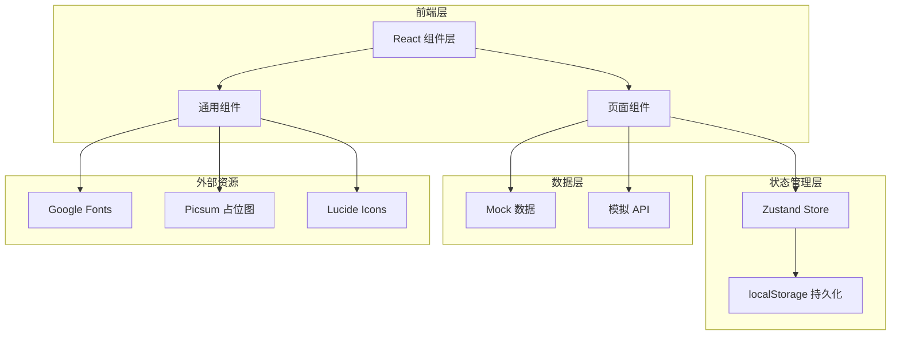
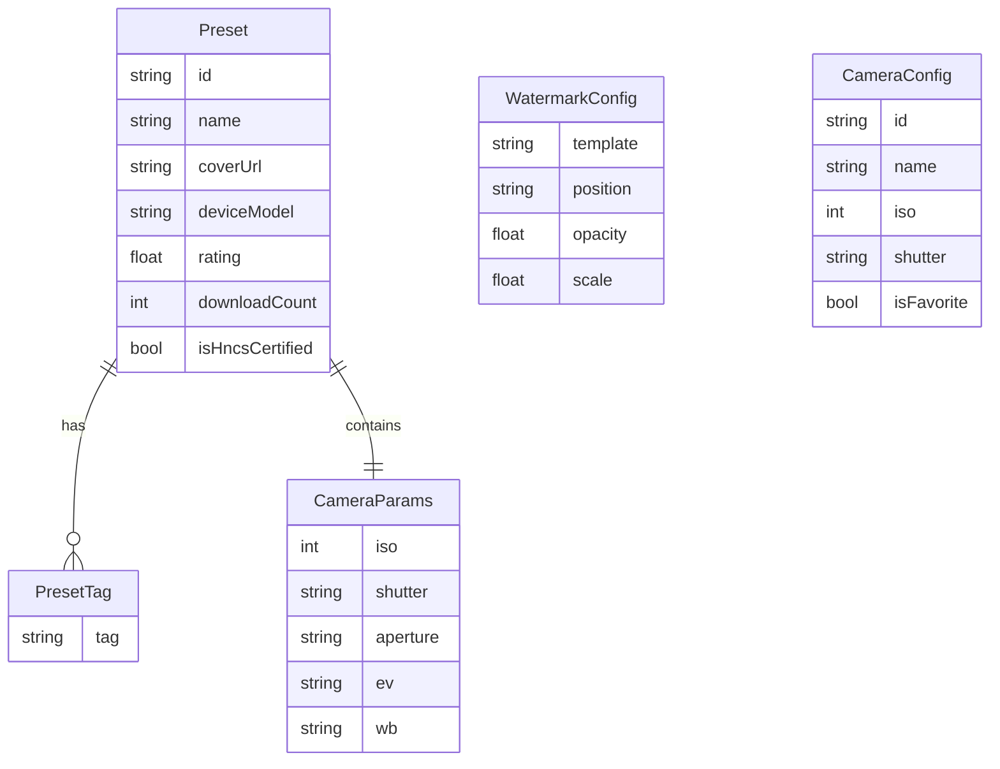

# OMaster APP Web展示 - 技术架构文档

## 1. 架构设计



## 2. 技术栈描述

- **前端框架**: React@18 + Vite@5
- **样式方案**: Tailwind CSS@3
- **路由管理**: React Router@6
- **状态管理**: Zustand@4
- **动画库**: Framer Motion@11
- **图标库**: Lucide React
- **字体**: Google Fonts (Playfair Display + Inter)
- **构建工具**: Vite
- **后端**: 无（纯前端静态站点）
- **数据库**: 无（使用Mock数据 + localStorage）

## 3. 路由定义

| 路由 | 用途 |
|------|------|
| `/` | 首页，展示品牌与核心特性 |
| `/presets` | 预设展示页，搜索/筛选/收藏 |
| `/presets/:id` | 预设详情页，参数展示与AI微调 |
| `/scene-detection` | AI场景检测演示页 |
| `/watermark` | 水印编辑演示页 |
| `/camera-config` | 相机配置管理演示页 |

## 4. API 定义（模拟）

由于纯前端展示，所有数据使用 mock 数据，定义如下 TypeScript 接口：

```typescript
// 预设数据
interface Preset {
  id: string;
  name: string;
  coverUrl: string;
  author: string;
  deviceModel: string;
  sceneType: string;
  tags: string[];
  rating: number;
  downloadCount: number;
  isHncsCertified: boolean;
  isFavorite: boolean;
  cameraParams: {
    iso: number;
    shutter: string;
    aperture: string;
    ev: string;
    wb: string;
    mode: string;
  };
  description: string;
}

// 场景类型
type SceneType = 
  | 'portrait'      // 人像
  | 'landscape'     // 风景
  | 'night'         // 夜景
  | 'food'          // 美食
  | 'street'        // 街拍
  | 'macro'         // 微距
  | 'sunset';       // 日落

// 场景检测结果
interface SceneDetectionResult {
  scene: SceneType;
  confidence: number;     // 0-1
  detectionTime: number;  // 毫秒
  isOffline: boolean;
  recommendedPresetIds: string[];
}

// 水印模板
type WatermarkTemplate = 
  | 'HASSELBLAD'
  | 'OPPO'
  | 'ONEPLUS'
  | 'REALME'
  | 'CUSTOM';

// 水印配置
interface WatermarkConfig {
  template: WatermarkTemplate;
  position: 'TOP_LEFT' | 'TOP_CENTER' | 'TOP_RIGHT' | 'CENTER' | 'BOTTOM_LEFT' | 'BOTTOM_CENTER' | 'BOTTOM_RIGHT';
  opacity: number;
  scale: number;
  customText: string;
  showTimestamp: boolean;
  showDevice: boolean;
}

// 相机配置
interface CameraConfig {
  id: string;
  name: string;
  description: string;
  iso: number;
  shutter: string;
  aperture: string;
  ev: string;
  wb: string;
  isFavorite: boolean;
  createdAt: number;
}
```

## 5. 数据模型



## 6. 项目结构

```
omaster-web/
├── public/
│   └── images/              # 静态图片资源
├── src/
│   ├── components/          # 通用组件
│   │   ├── Navbar.tsx       # 顶部导航
│   │   ├── Hero.tsx         # 首页Hero
│   │   ├── PresetCard.tsx   # 预设卡片
│   │   ├── SceneDetector.tsx # 场景检测器
│   │   ├── ParamTable.tsx   # 参数表格
│   │   ├── PhoneMockup.tsx  # 手机外壳
│   │   └── Footer.tsx       # 页脚
│   ├── pages/               # 页面组件
│   │   ├── Home.tsx
│   │   ├── Presets.tsx
│   │   ├── PresetDetail.tsx
│   │   ├── SceneDetection.tsx
│   │   ├── Watermark.tsx
│   │   └── CameraConfig.tsx
│   ├── store/               # Zustand状态
│   │   └── useAppStore.ts
│   ├── data/                # Mock数据
│   │   └── presets.ts
│   ├── types/               # TypeScript类型
│   │   └── index.ts
│   ├── utils/               # 工具函数
│   │   └── formatters.ts
│   ├── App.tsx              # 应用入口
│   ├── main.tsx             # 渲染入口
│   └── index.css            # 全局样式
├── index.html               # HTML 模板
├── package.json
├── tailwind.config.js
├── postcss.config.js
├── tsconfig.json
└── vite.config.ts
```

## 7. 关键设计决策

1. **纯前端展示**：使用 mock 数据，无需后端，降低部署复杂度
2. **localStorage 持久化**：收藏状态、AI配置持久化在浏览器
3. **响应式优先**：桌面端使用 3 列网格，移动端降为单列
4. **动画性能**：使用 Framer Motion 的 `viewport` API 实现滚动触发动画
5. **字体优化**：使用 `font-display: swap` 避免字体加载阻塞
6. **图片优化**：使用 Picsum 占位图（支持随机种子），避免使用真实图片资源
7. **无障碍**：所有交互元素支持键盘导航，焦点态可见
