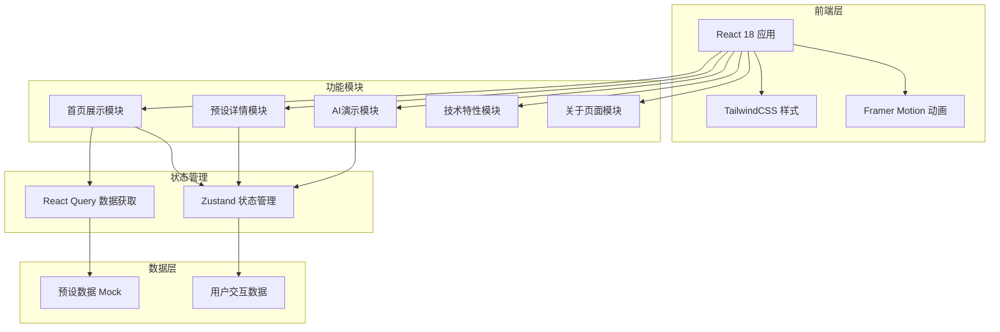
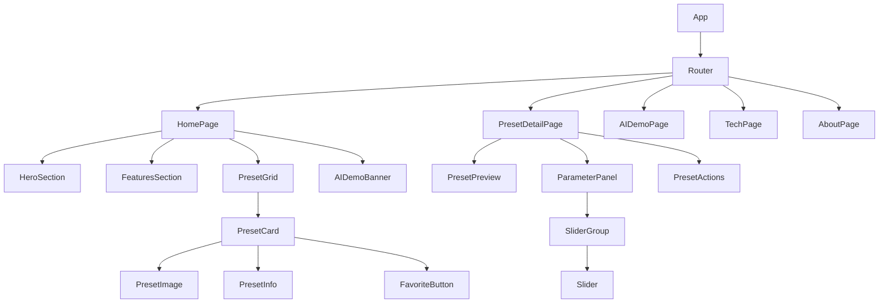

# OPPOMaster 网页版APP展示 - 技术架构文档

## 1. 架构设计

### 1.1 整体架构



### 1.2 技术栈概览

| 层级 | 技术 | 版本 | 说明 |
|------|------|------|------|
| 框架 | React | 18.x | UI框架 |
| 构建 | Vite | 5.x | 快速构建工具 |
| 样式 | TailwindCSS | 3.x | 原子化CSS框架 |
| 动画 | Framer Motion | 11.x | 交互动画库 |
| 状态 | Zustand | 4.x | 轻量状态管理 |
| 图标 | Lucide React | 最新 | 图标库 |

---

## 2. 技术选型说明

### 2.1 前端框架：React 18

**选择理由**：
- 组件化开发，提高代码复用性
- 虚拟DOM，性能优秀
- 生态丰富，社区活跃
- 支持TypeScript，类型安全

**核心特性使用**：
- Hooks (useState, useEffect, useMemo, useCallback)
- Context API 全局状态
- Suspense 加载状态

### 2.2 样式方案：TailwindCSS 3.x

**选择理由**：
- 原子化CSS，开发效率高
- 内置响应式设计支持
- JIT编译器，性能优异
- 与React完美结合

**配置要点**：
```javascript
// tailwind.config.js
module.exports = {
  content: ['./index.html', './src/**/*.{js,jsx}'],
  theme: {
    extend: {
      colors: {
        'hasselblad': '#D4A574',
        'oppo-green': '#00C853',
        'deep-space': '#121212',
        'deep-space-light': '#1E1E1E',
      },
      fontFamily: {
        'sans': ['Inter', 'system-ui', 'sans-serif'],
        'display': ['Source Han Sans CN', 'sans-serif'],
      }
    }
  },
  plugins: []
}
```

### 2.3 动画方案：Framer Motion 11.x

**选择理由**：
- 声明式动画API
- 性能优化，自动处理GPU加速
- 丰富的动画变体
- 手势识别支持

**核心用法**：
```jsx
<motion.div
  initial={{ opacity: 0, y: 20 }}
  animate={{ opacity: 1, y: 0 }}
  transition={{ duration: 0.5, delay: 0.1 }}
>
  {children}
</motion.div>
```

### 2.4 状态管理：Zustand 4.x

**选择理由**：
- 极简API，易于上手
- TypeScript支持完善
- 中间件支持
- 性能优秀

**状态设计**：
```typescript
interface AppState {
  selectedPreset: Preset | null;
  filterType: FilterType;
  searchQuery: string;
  theme: 'light' | 'dark';
  setSelectedPreset: (preset: Preset | null) => void;
  setFilterType: (type: FilterType) => void;
}
```

---

## 3. 路由定义

### 3.1 路由结构

| 路由 | 组件 | 功能描述 |
|------|------|----------|
| `/` | HomePage | 首页展示 |
| `/preset/:id` | PresetDetailPage | 预设详情页 |
| `/ai-demo` | AIDemoPage | AI演示页 |
| `/tech` | TechPage | 技术特性页 |
| `/about` | AboutPage | 关于我们页 |

### 3.2 路由配置

```typescript
// src/routes/index.tsx
const routes = [
  {
    path: '/',
    component: HomePage,
    meta: { title: '首页' }
  },
  {
    path: '/preset/:id',
    component: PresetDetailPage,
    meta: { title: '预设详情' }
  },
  {
    path: '/ai-demo',
    component: AIDemoPage,
    meta: { title: 'AI演示' }
  },
  {
    path: '/tech',
    component: TechPage,
    meta: { title: '技术特性' }
  },
  {
    path: '/about',
    component: AboutPage,
    meta: { title: '关于我们' }
  }
]
```

---

## 4. 数据模型

### 4.1 预设数据模型

```typescript
interface Preset {
  id: string;
  name: string;
  coverPath: string;
  sections: Section[];
  cameraParams: CameraParams | null;
  deviceModel: string;
  source: 'omaster_cloud' | 'community';
  isFavorite: boolean;
}

interface Section {
  title: string;
  content: string;
}

interface CameraParams {
  mode: string;
  filter: string;
  iso: number;
  shutter: string;
  ev: string;
  wb: string;
  hasselblad_hncs: boolean;
}
```

### 4.2 筛选类型

```typescript
enum FilterType {
  ALL = 'all',
  FAVORITES = 'favorites',
  HNCS = 'hncs',
  FIND_X = 'find_x',
  RENO = 'reno',
  NEW = 'new',
  TRENDING = 'trending'
}
```

### 4.3 Mock数据

```typescript
// src/data/mockPresets.ts
export const mockPresets: Preset[] = [
  {
    id: '1',
    name: '哈苏 X2D | 慵懒午后的佛罗伦萨',
    coverPath: 'hasselblad_florence_01',
    sections: [
      { title: '光感设置', content: '降低对比度，提高高光保留' },
      { title: '色彩调校', content: '暖色调偏移，饱和度适中' }
    ],
    cameraParams: {
      mode: 'master',
      filter: '复古',
      iso: 200,
      shutter: '1/250',
      ev: '+0.3',
      wb: '5600K',
      hasselblad_hncs: true
    },
    deviceModel: 'Find X8 Pro',
    source: 'omaster_cloud',
    isFavorite: false
  },
  // ... more presets
]
```

---

## 5. 组件架构

### 5.1 组件树



### 5.2 核心组件清单

| 组件 | 类型 | 功能 |
|------|------|------|
| `HeroSection` | 展示组件 | 首页Hero区域 |
| `FeatureCard` | 展示组件 | 功能特性卡片 |
| `PresetGrid` | 容器组件 | 预设网格布局 |
| `PresetCard` | 展示组件 | 单个预设卡片 |
| `PresetPreview` | 展示组件 | 预设大图预览 |
| `ParameterPanel` | 交互组件 | 参数调节面板 |
| `ImageSlider` | 交互组件 | 滑块调节器 |
| `AIDemoUploader` | 交互组件 | AI演示图片上传 |
| `NavigationBar` | 导航组件 | 页面导航 |

---

## 6. 性能优化策略

### 6.1 代码分割

```typescript
// React.lazy 进行路由级代码分割
const HomePage = lazy(() => import('./pages/HomePage'));
const PresetDetailPage = lazy(() => import('./pages/PresetDetailPage'));
```

### 6.2 图片优化

- 使用WebP格式
- 实现懒加载
- 提供响应式图片
- 使用placeholder骨架屏

```jsx
<Image
  src={preset.coverPath}
  placeholder="blur"
  loading="lazy"
  sizes="(max-width: 768px) 100vw, 50vw"
/>
```

### 6.3 缓存策略

- React Query缓存预设数据
- 浏览器本地存储收藏状态
- Service Worker缓存静态资源

### 6.4 动画优化

- 使用transform和opacity
- will-change属性提示
- 合理的动画时长控制
- 按需加载动画库

---

## 7. 浏览器兼容

### 7.1 兼容性目标

| 浏览器 | 最低版本 | 支持度 |
|--------|---------|--------|
| Chrome | 90+ | ✅ 完全支持 |
| Firefox | 88+ | ✅ 完全支持 |
| Safari | 14+ | ✅ 完全支持 |
| Edge | 90+ | ✅ 完全支持 |
| iOS Safari | 14+ | ✅ 完全支持 |
| Android Chrome | 90+ | ✅ 完全支持 |

### 7.2 Polyfill策略

- 使用Babel进行语法转换
- 核心功能使用原生API
- 动画使用CSS fallback

---

## 8. 部署方案

### 8.1 构建产物

```
dist/
├── index.html
├── assets/
│   ├── index-[hash].js
│   ├── index-[hash].css
│   └── images/
└── favicon.ico
```

### 8.2 部署平台

- **推荐**：Vercel / Netlify
- **备选**：GitHub Pages / 阿里云OSS

### 8.3 CI/CD流程

```yaml
# .github/workflows/deploy.yml
name: Deploy
on:
  push:
    branches: [main]
jobs:
  deploy:
    runs-on: ubuntu-latest
    steps:
      - uses: actions/checkout@v3
      - uses: actions/setup-node@v3
        with:
          node-version: '18'
      - run: npm install
      - run: npm run build
      - uses: peaceiris/actions-gh-pages@v3
        with:
          github_token: ${{ secrets.GITHUB_TOKEN }}
          publish_dir: ./dist
```

---

## 9. 项目文件结构

```
opmaster-web/
├── public/
│   ├── favicon.ico
│   └── images/
│       └── presets/
├── src/
│   ├── assets/
│   │   ├── styles/
│   │   │   └── globals.css
│   │   └── images/
│   ├── components/
│   │   ├── common/
│   │   │   ├── NavigationBar.tsx
│   │   │   └── Footer.tsx
│   │   ├── home/
│   │   │   ├── HeroSection.tsx
│   │   │   ├── FeatureCard.tsx
│   │   │   └── PresetGrid.tsx
│   │   ├── preset/
│   │   │   ├── PresetCard.tsx
│   │   │   ├── PresetPreview.tsx
│   │   │   └── ParameterPanel.tsx
│   │   └── ai/
│   │       └── AIDemoUploader.tsx
│   ├── pages/
│   │   ├── HomePage.tsx
│   │   ├── PresetDetailPage.tsx
│   │   ├── AIDemoPage.tsx
│   │   ├── TechPage.tsx
│   │   └── AboutPage.tsx
│   ├── data/
│   │   └── mockPresets.ts
│   ├── hooks/
│   │   └── usePreset.ts
│   ├── store/
│   │   └── useAppStore.ts
│   ├── utils/
│   │   └── imageOptimizer.ts
│   ├── App.tsx
│   └── main.tsx
├── index.html
├── package.json
├── vite.config.ts
├── tailwind.config.js
├── tsconfig.json
└── README.md
```

---

## 10. 开发指南

### 10.1 环境要求

- Node.js >= 18.0.0
- npm >= 9.0.0

### 10.2 快速开始

```bash
# 克隆项目
git clone <repository-url>
cd opmaster-web

# 安装依赖
npm install

# 启动开发服务器
npm run dev

# 构建生产版本
npm run build

# 预览生产版本
npm run preview
```

### 10.3 代码规范

- 使用ESLint + Prettier
- 组件采用PascalCase
- 函数采用camelCase
- 常量采用UPPER_SNAKE_CASE
- CSS类名采用kebab-case

---

*文档版本：1.0*
*创建时间：2024年*
*最后更新：2024年*
