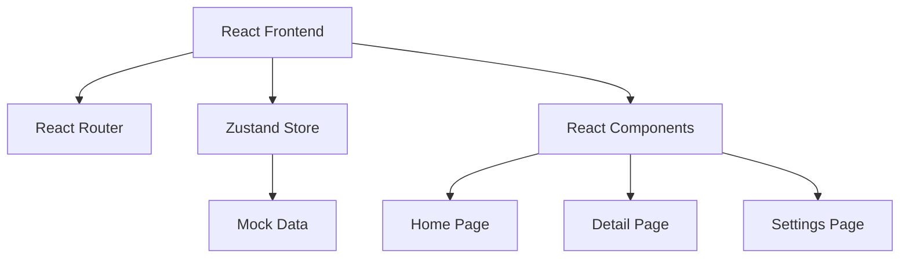
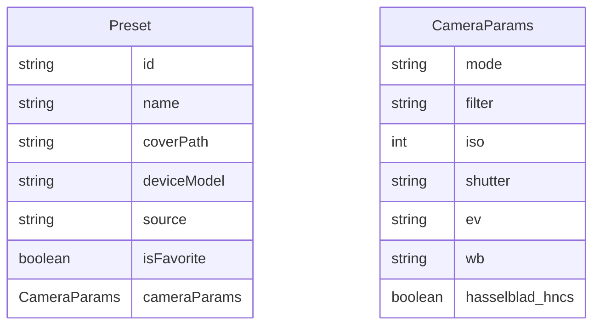

## 1. Architecture Design
纯前端架构，使用React构建单页应用架构



## 2. Technology Description
- 前端: React@18 + TypeScript + tailwindcss@3 + vite
- 初始化工具: vite-init
- 后端: None（纯前端应用）
- 状态管理: zustand
- 路由: react-router-dom

## 3. Route Definitions
| Route | Purpose |
|-------|---------|
| / | 首页 - 预设列表和搜索筛选 |
| /detail/:id | 详情页 - 显示预设详细信息 |
| /settings | 设置页 - 主题切换和应用设置 |

## 4. Data Model

### 4.1 Data Model Definition


### 4.2 TypeScript Type Definitions
```typescript
export interface CameraParams {
  mode: string;
  filter: string;
  iso: number;
  shutter: string;
  ev: string;
  wb: string;
  hasselblad_hncs: boolean;
}

export interface Preset {
  id: string;
  name: string;
  coverPath: string;
  deviceModel: string;
  source: string;
  isFavorite: boolean;
  cameraParams?: CameraParams;
}

export type FilterType = 'ALL' | 'FAVORITES' | 'HNCS' | 'FIND_X' | 'RENO';

export type ThemeMode = 'light' | 'dark' | 'system';
```

## 5. File Structure
```
omaster-web/
├── src/
│   ├── components/
│   │   ├── FilterChips.tsx
│   │   ├── PresetCard.tsx
│   │   └── SearchBar.tsx
│   ├── pages/
│   │   ├── Home.tsx
│   │   ├── Detail.tsx
│   │   └── Settings.tsx
│   ├── store/
│   │   └── useStore.ts
│   ├── types/
│   │   └── index.ts
│   ├── App.tsx
│   ├── main.tsx
│   └── index.css
├── package.json
├── vite.config.ts
├── tailwind.config.js
└── tsconfig.json
```
