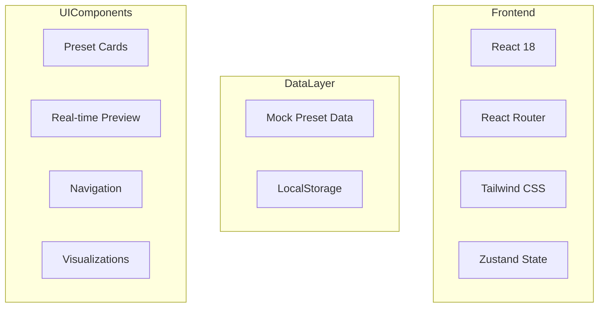
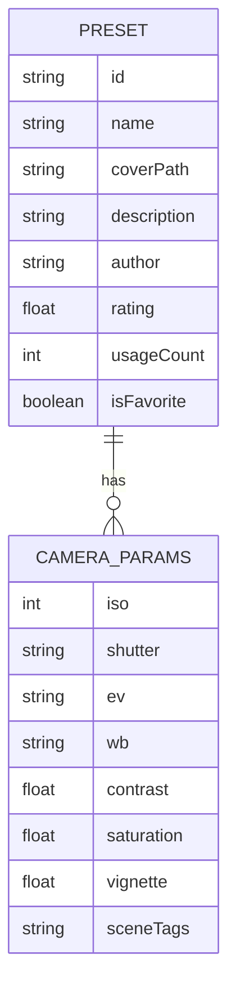

## 1. Architecture Design


## 2. Technology Description
- Frontend: React@18 + tailwindcss@3 + vite
- Initialization Tool: vite-init
- Backend: None (Frontend-only demo)
- Database: LocalStorage for user preferences
- Animation: Framer Motion, CSS animations

## 3. Route Definitions
| Route | Purpose |
|-------|---------|
| / | 首页 - 预设展示和导航 |
| /preset/:id | 预设详情页 |
| /ai-scene | AI 场景识别演示 |
| /color-analysis | 色调分析演示 |

## 4. Data Model

### 4.1 Data Model Definition


### 4.2 TypeScript Interfaces
```typescript
interface CameraParams {
  mode: string;
  filter: string;
  iso: number;
  shutter: string;
  ev: string;
  wb: string;
  hasselblad_hncs: boolean;
  contrast: number;
  saturation: number;
  sharpness: number;
  vignette: number;
  videoLut: string;
  sceneTags: string[];
}

interface Preset {
  id: string;
  name: string;
  coverPath: string;
  sections: Section[];
  cameraParams: CameraParams;
  deviceModel: string;
  source: string;
  isFavorite: boolean;
  createdAt: number;
  updatedAt: number;
  usageCount: number;
  rating: number;
  author: string;
}

interface Section {
  title: string;
  content: string;
}
```
