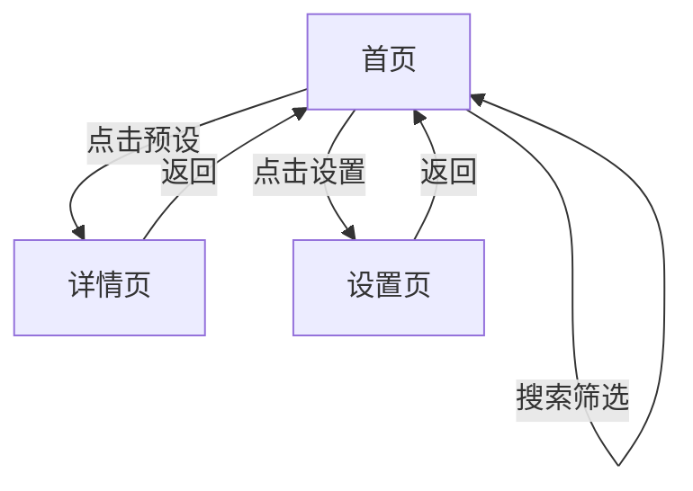

## 1. Product Overview
OMaster Web是一款为OPPO哈苏影像系统设计的专业调色参数库Web应用，提供与Android版本相同的功能体验，让用户可以在浏览器中浏览和使用哈苏专业预设。

## 2. Core Features

### 2.1 Feature Module
1. **首页**: 预设列表展示、搜索筛选、收藏标记
2. **详情页**: 预设详细信息、参数展示、收藏功能
3. **设置页**: 主题切换（深色/浅色/跟随系统）

### 2.3 Page Details
| Page Name | Module Name | Feature description |
|-----------|-------------|---------------------|
| 首页 | 预设网格 | 以卡片形式展示所有哈苏专业预设，支持点击查看详情 |
| 首页 | 搜索栏 | 实时搜索预设名称，快速找到目标预设 |
| 首页 | 筛选芯片 | 按分类筛选预设（全部、收藏、HNCS、Find X、Reno） |
| 详情页 | 参数展示 | 显示相机参数（模式、滤镜、ISO、快门、曝光补偿、白平衡、HNCS认证） |
| 详情页 | 收藏功能 | 一键收藏/取消收藏预设 |
| 设置页 | 主题切换 | 支持浅色、深色、跟随系统三种主题模式 |

## 3. Core Process
用户打开应用 → 浏览预设列表 → 使用搜索或筛选功能找到目标预设 → 点击查看详细信息 → 收藏常用预设 → 在设置页切换主题

## 4. User Interface Design
### 4.1 Design Style
- 主色调：深蓝色 (#1A73E8) 和金黄色 (#FFD700)
- 按钮风格：圆角矩形，带有轻微阴影
- 字体：Inter 为主，搭配专业排版
- 布局风格：卡片式网格布局，顶部导航
- 配色风格：专业、优雅，类似专业摄影应用

### 4.2 Page Design Overview
| Page Name | Module Name | UI Elements |
|-----------|-------------|-------------|
| 首页 | 顶部导航栏 | 品牌标识、设置按钮 |
| 首页 | 搜索栏 | 搜索输入框、清除按钮 |
| 首页 | 筛选芯片 | 可点击的筛选标签，支持选中状态 |
| 首页 | 预设卡片 | 封面图、预设名称、设备型号、收藏按钮 |
| 详情页 | 详情内容 | 大封面图、预设信息、相机参数、使用说明 |
| 设置页 | 设置选项 | 主题选择器、关于信息 |

### 4.3 Responsiveness
桌面端优先，响应式适配平板和移动设备

### 4.4 交互效果
- 卡片悬停效果：轻微上浮、阴影加深
- 收藏按钮动画：缩放和颜色变化
- 页面切换：平滑过渡动画
- 筛选芯片：选中时背景色变化
