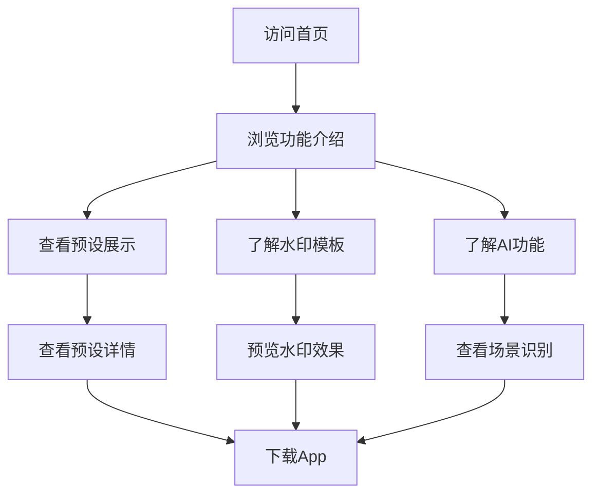

# OMaster App 功能展示网站 - PRD

## 1. 产品概述
OMaster是一款专业级手机摄影参数预设管理应用，支持OPPO Find系列哈苏影像系统。本网站用于展示App的核心功能和特色。

- 目标用户：摄影爱好者、专业摄影师、OPPO/一加/真我手机用户
- 核心价值：专业级哈苏色彩科学 + 智能化参数推荐 + 设备深度适配

## 2. 核心功能

### 2.1 功能模块
1. **首页展示**：Hero区域、功能导航、预设预览
2. **AI场景识别**：智能识别拍摄场景，推荐最佳参数
3. **预设管理**：预设导入导出、收藏、分类筛选
4. **水印编辑器**：多种水印模板，支持自定义
5. **参数调节**：专业参数精细调节，实时预览

### 2.2 页面详情

| 页面名称 | 模块名称 | 功能描述 |
|---------|---------|---------|
| 首页 | Hero区域 | 应用介绍、核心卖点、下载入口 |
| 首页 | 功能展示 | AI场景识别、预设管理、水印编辑等核心功能卡片 |
| 预设展示 | 预设列表 | 分类展示预设，支持筛选和搜索 |
| 预设展示 | 预设详情 | 参数展示、样张预览、应用按钮 |
| 水印模板 | 模板选择 | 展示多种水印模板效果预览 |
| AI功能 | 场景识别 | 展示AI识别能力和推荐效果 |

## 3. 核心流程

用户访问网站 → 浏览功能介绍 → 查看预设展示 → 了解水印模板 → 下载App

## 4. 用户界面设计

### 4.1 设计风格
- 主色调：哈苏橙色 (#E65100) + 深色背景 (#1A1A1A)
- 辅助色：OPPO绿 (#00C853) + 纯白文字
- 按钮风格：圆角按钮，渐变背景，悬停动画
- 字体：思源黑体 (Noto Sans SC) + Inter
- 布局风格：卡片式布局，响应式设计
- 图标风格：线性图标，2px描边

### 4.2 页面设计概览

| 页面名称 | 模块名称 | UI元素 |
|---------|---------|--------|
| 首页 | Hero区域 | 渐变背景、大标题、功能亮点、CTA按钮 |
| 首页 | 功能卡片 | 图标、标题、描述、悬停效果 |
| 预设展示 | 预设网格 | 卡片布局、参数标签、收藏按钮 |
| 水印模板 | 模板展示 | 效果预览图、模板名称、使用说明 |

### 4.3 响应式设计
- 桌面端优先设计
- 移动端自适应布局
- 触摸优化交互

## 5. 技术要求
- 单页应用 (SPA)
- 响应式设计
- 平滑滚动动画
- 暗色主题
