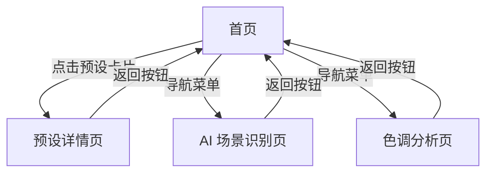

## 1. Product Overview
OPPO Master - 专业相机预设与参数管理的视觉演示应用
- 为摄影爱好者提供专业相机预设库、AI 场景识别和实时参数预览
- 展示产品的核心功能和视觉设计，提升用户对产品的理解

## 2. Core Features

### 2.1 User Roles
| Role | Registration Method | Core Permissions |
|------|---------------------|------------------|
| 访客用户 | 无需注册 | 浏览预设、查看演示功能、体验交互设计 |

### 2.2 Feature Module
1. **首页**: 预设卡片网格、导航栏、搜索和筛选、统计数据
2. **预设详情页**: 参数展示、实时预览、收藏功能、相关推荐
3. **AI 场景识别页**: 场景检测、智能推荐、可视化展示
4. **色调分析页**: 颜色提取、预设匹配、自定义参数生成

### 2.3 Page Details
| Page Name | Module Name | Feature description |
|-----------|-------------|---------------------|
| 首页 | Hero 区域 | 品牌标识、标语、核心价值主张展示、CTA 按钮 |
| 首页 | 预设网格 | 响应式卡片布局、悬停动画、快速收藏、卡片跳转 |
| 首页 | 统计卡片 | 预设总数、用户数、下载量等关键指标展示 |
| 预设详情页 | 参数面板 | ISO、快门、白平衡等相机参数展示、动态调整 |
| 预设详情页 | 实时预览 | 分屏对比模式、色调实时预览、胶囊动画 |
| AI 场景识别页 | 场景分类 | 6种场景分类展示、置信度可视化、AI 推荐逻辑 |
| 色调分析页 | 颜色分析 | 主色调提取、直方图可视化、预设匹配结果 |

## 3. Core Process
用户访问首页 → 浏览预设卡片 → 点击查看详情 → 体验参数调整和实时预览 → 查看 AI 场景识别和色调分析功能 → 返回首页继续探索

## 4. User Interface Design
### 4.1 Design Style
- 主色调：深蓝色 (#1E40AF)、紫色渐变 (#6366F1 → #8B5CF6)、金色点缀 (#FBBF24)
- 按钮风格：圆角矩形、悬浮阴影、渐变背景
- 字体：Inter (主标题)、Source Sans Pro (正文)
- 布局风格：卡片式布局、网格系统、现代化简洁设计
- 图标风格：线性图标、统一圆角、与色彩系统协调

### 4.2 Page Design Overview
| Page Name | Module Name | UI Elements |
|-----------|-------------|-------------|
| 首页 | Hero 区域 | 渐变背景、大标题、动画文字、玻璃态卡片 |
| 首页 | 预设网格 | 响应式卡片、悬停缩放、渐变边框、动画加载 |
| 预设详情页 | 参数面板 | 拟物化仪表盘、滑动条、数值显示、动画过渡 |
| AI 场景识别页 | 场景展示 | 卡片堆叠、图标动画、进度条、交互反馈 |

### 4.3 Responsiveness
- Desktop-first, mobile-adaptive, touch optimization
- 断点设计：1200px、992px、768px、576px
- 触摸友好的按钮尺寸和间距
- 移动端优化的导航和布局

### 4.4 3D Scene Guidance (Not applicable for this demo)
