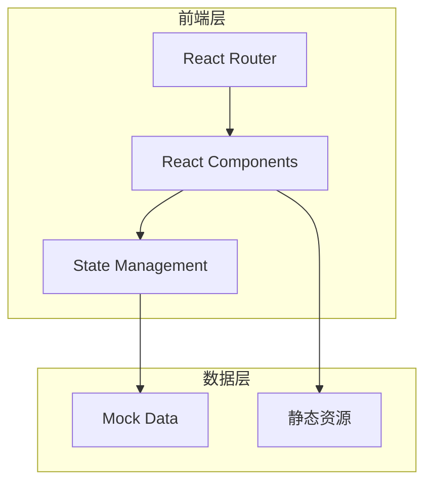

# OMaster App 功能展示网站 - 技术架构

## 1. 架构设计



## 2. 技术说明
- 前端框架：React 18 + TypeScript
- 样式方案：Tailwind CSS 3
- 构建工具：Vite
- 动画库：Framer Motion
- 图标：Lucide React

## 3. 路由定义

| 路由 | 用途 |
|-----|------|
| / | 首页，展示核心功能 |
| /presets | 预设展示页面 |
| /watermark | 水印模板展示 |
| /ai | AI功能展示 |

## 4. 数据模型

### 4.1 预设数据模型

```typescript
interface Preset {
  id: string;
  name: string;
  coverUrl: string;
  deviceModel: string;
  author: string;
  description: string;
  sceneType: string;
  tags: string[];
  rating: number;
  downloadCount: number;
  isHncsCertified: boolean;
  cameraParams: CameraParams;
}

interface CameraParams {
  mode: string;
  iso: number;
  shutter: string;
  ev: string;
  wb: string;
  aperture: string;
  hasselblad_hncs: boolean;
  colorStyle: string;
}
```

### 4.2 水印模板数据模型

```typescript
interface WatermarkTemplate {
  id: string;
  name: string;
  description: string;
  previewUrl: string;
  category: 'brand' | 'functional' | 'opensource';
}
```

## 5. 组件结构

```
src/
├── components/
│   ├── Hero.tsx           # 首页Hero区域
│   ├── FeatureCard.tsx    # 功能卡片
│   ├── PresetCard.tsx     # 预设卡片
│   ├── WatermarkCard.tsx  # 水印模板卡片
│   └── Navigation.tsx     # 导航栏
├── pages/
│   ├── Home.tsx           # 首页
│   ├── Presets.tsx        # 预设展示
│   ├── Watermark.tsx      # 水印模板
│   └── AIFeatures.tsx     # AI功能
├── data/
│   ├── presets.ts         # 预设数据
│   └── watermarks.ts      # 水印模板数据
└── App.tsx                # 主应用
```

## 6. 性能优化
- 图片懒加载
- 代码分割
- 静态资源CDN
- Gzip压缩
