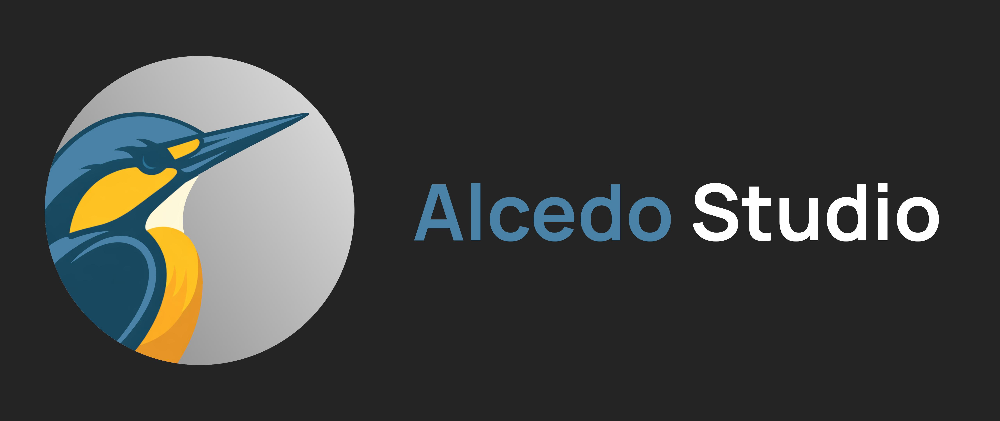
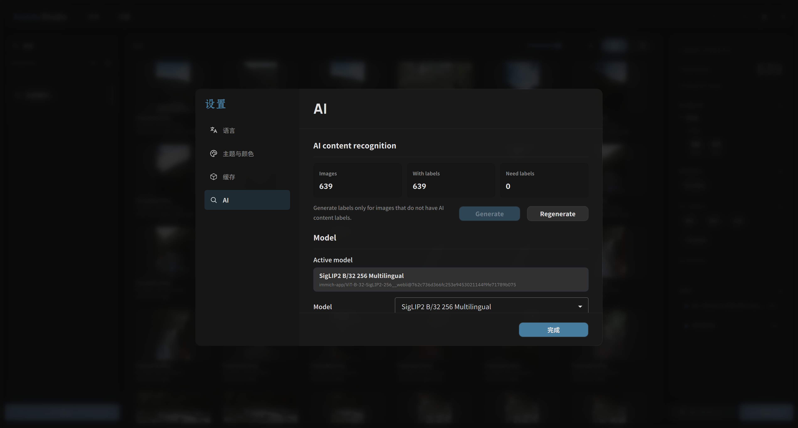
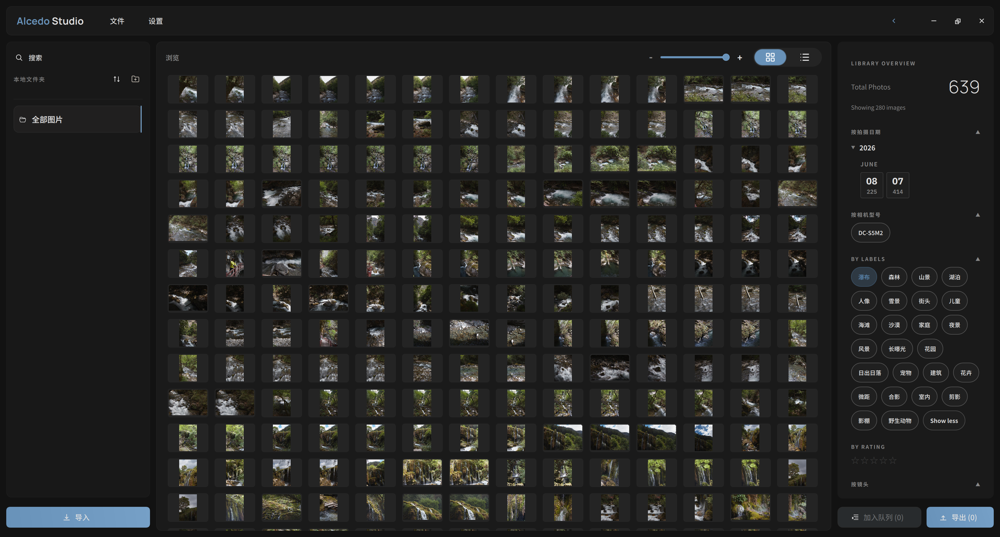
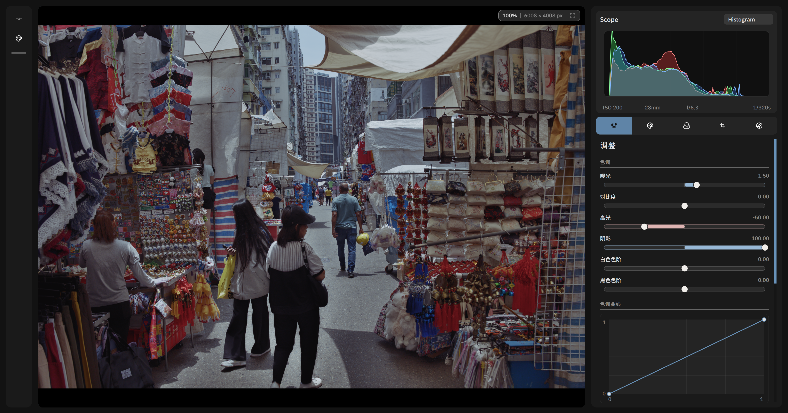
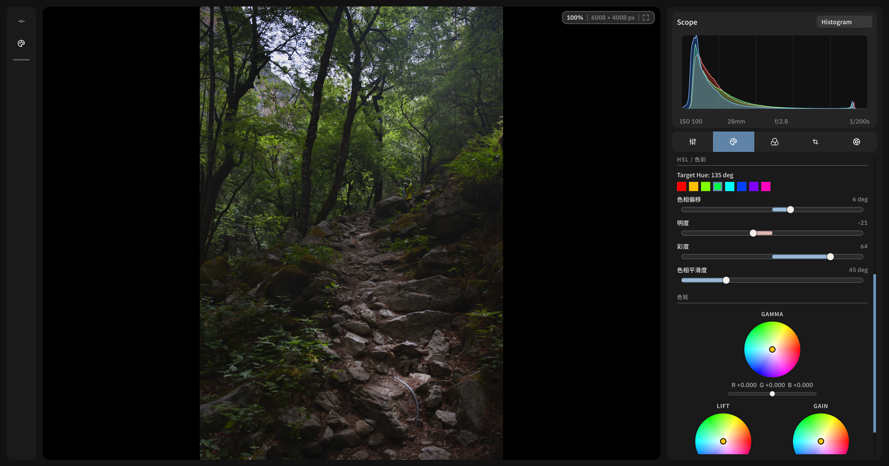
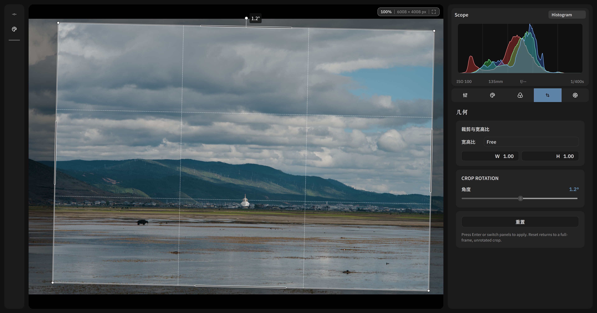
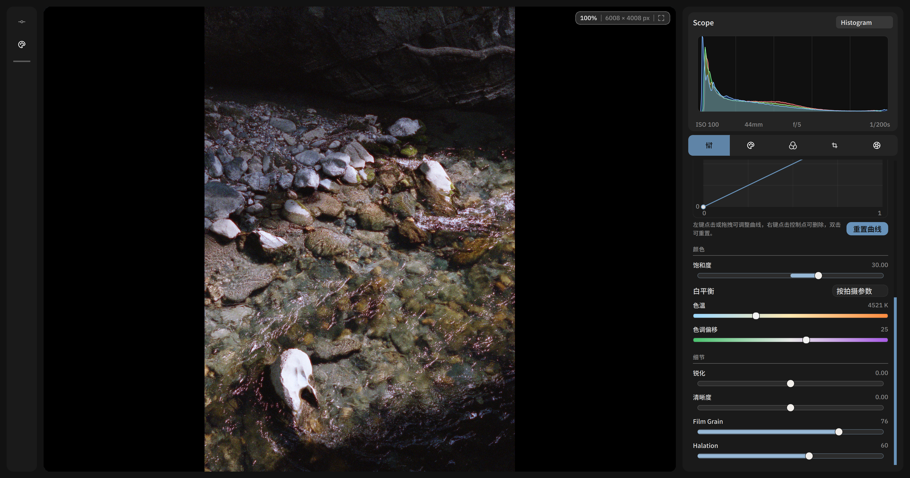

[Project website](https://zidage.github.io/AlcedoStudio) | [项目网页](https://zidage.github.io/AlcedoStudio)

<p align="right"><a href="./README.md"><strong>English</strong></a> | <a href="./README.zh-CN.md">简体中文</a></p>


**Alcedo Studio** is an open-source RAW photo editor and digital asset management (DAM) project. It is designed to provide a new choice to photographers who seek a lightweight, high-performance, and largely industry-compatible workflow for their photo editing and library management needs — with a built-in AI layer that tags your photos, answers natural-language searches, and curates your keepers. On-device by default, cloud optional. 

>Alcedo Studio is _**NOT an alternative**_ to the existing commercial software nor other open-source projects.


## Screenshots and Demo

The screenshots below are the current project-website image set from
`docs/alcedo-website/public/screenshots`, refreshed for the v0.2.6-era UI.

<table>
  <colgroup>
    <col style="width: 76%" />
    <col style="width: 24%" />
  </colgroup>
  <tbody>
    <tr>
      <td></td>
      <td>Library browser — folder tree, fast thumbnail grid, Library Overview facets, AI labels, ratings, and import/export actions in one workspace</td>
    </tr>
    <tr>
      <td></td>
      <td>Advanced filtering — exact/fuzzy search, date/camera/lens facets, rating filters, and thumbnail-backed results for large projects</td>
    </tr>
    <tr>
      <td></td>
      <td>AI content recognition — local CLIP / SigLIP model management, generation status, and model activation without uploading your photos</td>
    </tr>
    <tr>
      <td></td>
      <td>AI content filtering — generated semantic labels become first-class library filters that can be combined with EXIF and rating criteria</td>
    </tr>
    <tr>
      <td></td>
      <td>Natural-language search — describe a scene in plain language, switch on semantic search, and rank matches through the local vector index</td>
    </tr>
    <tr>
      <td></td>
      <td>Dual color science — ACES 2.0 and OpenDRT output rendering with display colour space, EOTF, and peak-luminance controls</td>
    </tr>
    <tr>
      <td></td>
      <td>Real-time adjustments — exposure, contrast, white balance, tone curve, local Highlights/Shadows, live histogram, and GPU-backed preview</td>
    </tr>
    <tr>
      <td></td>
      <td>Advanced color — HSL separation, color wheels, channel mixing, and live scopes for precise creative grading</td>
    </tr>
    <tr>
      <td></td>
      <td>Geometry tools — crop, rotate, lens distortion, perspective repair, and common aspect-ratio presets</td>
    </tr>
    <tr>
      <td></td>
      <td>Film simulation — curated Kodak, Fuji, and Agfa CUBE LUTs for one-click film looks, including Portra-style portrait rendering</td>
    </tr>
    <tr>
      <td></td>
      <td>Film grain and halation — adjustable grain density/granularity plus red-biased highlight bloom across CPU, CUDA, OpenCL, and Metal paths</td>
    </tr>
    <tr>
      <td></td>
      <td>Export workflow — SDR/HDR parameters, ICC profile embedding, metadata handling, and multi-format output</td>
    </tr>
  </tbody>
</table>

>Some demo RAW files used by the project are from [signatureedits](https://www.signatureedits.com/free-raw-photos/) 100% Free Raw Files.

## What Changed Since v0.2.3

v0.2.3 was the Alcedo Studio rebrand and WebGPU/D3D12 experiment. The releases after it shifted the project from prototype breadth toward a more practical editor and DAM:

| Release cycle | Highlights |
| --- | --- |
| **v0.2.4** | Retired the experimental WebGPU path and moved GPU backend work to OpenCL; added OpenCL image containers, program management, RAW/point/linear-reference operators, DRT/LMT, lens calibration, geometry, DNG warp, scope analysis, and runtime backend switching. The editor was split into dedicated tone, RAW decoding, geometry, DRT, color, and versioning panels, while Sleeve gained collection membership, pagination, cache invalidation, star ratings, global search, and disk-backed thumbnail caching. |
| **v0.2.5** | Rebuilt Highlights/Shadows around LLF-style local tone processing, improved OKLCh/HLS color handling, added batch copy/paste adjustment transfer, refreshed geometry/crop interactions, and overhauled HDR export metadata plus UltraHDR writer paths. |
| **v0.2.6** | Landed the AI-native library work: semantic image labels, model profiles, Jina CLIP / SigLIP handling, HNSW vector search, semantic filtering, model download/activation UX, and async model execution. This cycle also added film grain and Halation effects across CPU/CUDA/OpenCL/Metal, Nikon HE/HE* RAW support through patched LibRaw, macOS CoreML model support, LUT favorites, and the current website screenshot refresh. |

## AI-Native Workflow

Your library talks back. Alcedo Studio ships a two-tier AI stack — an **on-device vision engine** that runs locally with zero cloud, and **optional remote multimodal LLMs** for the kind of judgment that needs a bigger brain. The result: a RAW archive that tags itself, rates itself, and answers to plain language.

### Your photos describe themselves

A bundled vision sidecar runs CLIP / SigLIP-style models entirely on your machine — no API key, no upload, no photo ever leaves your disk. MobileCLIP2, SigLIP2, Jina CLIP v2, and macOS CoreML profiles can auto-tag images and write labels straight into your library. Switch models anytime; old tags stay neatly isolated until you switch back.

### Search by feeling, not by filename

Type *"golden-hour portraits by the sea"* and hit enter. Your query becomes a vector and ranks against your library through a fast on-device HNSW index — no scrolling through thousands of thumbnails, no guessing which folder. Direct labels and EXIF-shaped queries still take the instant path; the AI only spins up when you actually mean something fuzzy. All local, all private.

### An AI critic that writes stars

Want a second opinion? Point it at your selects and a remote vision LLM returns a caption, searchable tags, and a 1–5 star aesthetic rating with reasons — written back to the EXIF so the score shows up everywhere: the star UI, stats, thumbnail cards. Bring an OpenAI-compatible endpoint, Anthropic, or 火山方舟 Doubao, or plug in your own. Your API key stays in the OS keychain — never in logs, args, or project files. And because critics rarely agree, pick a mood: Lite / Normal / High / xHigh / Max — 水 / 普通 / 大师 / 老法师 / 懂哥 — from generous to *that guy*.

### Long jobs, out of your way

Tagging a whole album, running the LLM on your selects, pulling down a model — all run as cancellable background tasks with progress, ETA, and download / activation feedback. An interaction lock quietly blocks the mid-run actions that would corrupt state, so you keep editing while the AI works.

## Key Technical Features

### High-Performance Core

- CUDA, Metal, and OpenCL accelerated image processing paths, with the Windows CUDA preview path reaching ***300 FPS*** at the highest real-time preview resolution on modern NVIDIA GPUs with large RAW files (e.g., 45MP). Even full-resolution 42MP preview generation takes only around **20ms** on a mid-range GPU (RTX 3080 Laptop 8GB).
- Runtime GPU backend selection for supported operators, including OpenCL coverage for RAW processing, point operators, linear reference conversion, highlight reconstruction, DRT/LMT, lens calibration, geometry adjustment, DNG warp, and scope analysis.
- Fine-grained memory management, resolution-separated thumbnail requests, and disk-backed thumbnail caching to optimize memory usage during large library browsing. The average DRAM usage for browsing a library of **786 42MP RAW** files is around **767MB** while achieving smooth scrolling and instant preview generation.
- Written in modern C++20 with a focus on code quality, modularity, and maintainability (unfortunately, still largely a WIP).

### Professional Imaging Pipeline

- 32-bit floating-point processing pipeline.
- Support **ACES 2.0 Output Rendering** and **OpenDRT** with display color space, EOTF, and peak-luminance controls.
- Film-like highlight transition, highlight reconstruction, LLF-style local Highlights/Shadows, sigmoid contrast curve, and RCD demosaic support for high-quality RAW reconstruction.
- **CUBE** LUT support for creative color grading, including a curated set of packaged Kodak, Fuji, and Agfa film-emulation LUTs plus favorites.
- Film grain and Halation output effects with shared history/pipeline integration across CPU, CUDA, OpenCL, and Metal.
- Support JPEG/TIFF/PNG/EXR output with metadata write-back, ICC embedding, HDR/SDR export metadata, and UltraHDR writer paths.
- OpenImageIO/Exiv2-based image output with support for various formats and metadata handling.

### Branchable, Content-Addressed Edit History

Every photo carries its own version tree. Each **Version** is a named look with its own undo/redo timeline, and every one of them replays from that photo's import baseline — not from one another — so you can branch off a look, keep editing the original, and the two never tangle. Switch the active version to A/B compare, or clone the whole history onto another image to reuse the recipe across a shoot.

- Undo/redo is just a cursor moving through an ordered edit log — the log is the single source of truth, the rendered image is a cache.
- Branch by spinning up a new named version; rename it, remove it (the import baseline is permanent), and switch the active one to compare side by side.
- Every version is content-addressed: a Merkle-tree hash over its ordered edits and cursor, so two identical edit timelines always hash the same.

### Asset Management ("Sleeve" System)

- A simple but flexible inode-like file system using DuckDB as the storage backend, designed to manage both the original RAW files and the generated metadata (previews, thumbnails, edit history, etc.) in a unified way.
- Lean project management with a single project file that contains all the metadata and references to the original files, enabling easy project sharing and backup without worrying about missing sidecar files or broken links.
- Collection membership, folder pagination, cache invalidation, duplicate/history handling, and batch database mutation paths for smoother large-project operations.
- Advanced search and filtering — EXIF facets, fuzzy/exact global search, star ratings, thumbnail-backed results, plus AI semantic search and auto-tagging that turn the library into something you can talk to (see [AI-Native Workflow](#ai-native-workflow)).

## System Requirements

- Windows 10/11 x64 for the current Qt RHI editor build, with CUDA acceleration on NVIDIA GPUs and OpenCL coverage for supported operators/backends.
- macOS on Apple Silicon for the Metal-backed Qt application build.
- NVIDIA GPU with CUDA support (minimum compute capability 6.0 / 10-series or later, recommended 7.0+ / 20-series or later) for the fastest Windows path; preferably 6GB+ VRAM for smooth work with high-resolution RAW files (40MP+).
- A Metal-capable Apple Silicon Mac for the macOS/Metal build.
- At least 8GB of system RAM (16GB+ recommended for larger libraries and smoother performance).
- 500MB of free disk space for the installation and temporary working files.
- 60+ MB for installation package and partial update support.

## Build from Source

Detailed bilingual instructions are in:
- [docs/build_from_source.md](docs/build_from_source.md)

构建细节（中英对照）已单独维护在：
- [docs/build_from_source.md](docs/build_from_source.md)

Quick commands:

```powershell
# Required submodules for current CMake layout
git submodule update --init --recursive `
  alcedo_studio/src/third_party/lensfun `
  alcedo_studio/src/third_party/libultrahdr `
  alcedo_studio/src/third_party/metal-cpp

# Windows debug (MSVC wrapper + preset)
cmd /c scripts\msvc_env.cmd --preset win_debug -DCMAKE_PREFIX_PATH="D:/Qt/6.9.3/msvc2022_64/lib/cmake"
cmd /c scripts\msvc_env.cmd --build --preset win_debug --parallel 8

# Windows release
cmd /c scripts\msvc_env.cmd --preset win_release -DCMAKE_PREFIX_PATH="D:/Qt/6.9.3/msvc2022_64/lib/cmake"
cmd /c scripts\msvc_env.cmd --build --preset win_release --parallel 8
cmd /c scripts\msvc_env.cmd --install build/release --prefix build/install

# macOS debug and packaging
cmake --preset macos_debug
cmake --build --preset macos_debug --target alcedo_main
cmake --preset macos_release
cmake --build --preset macos_release
cmake --build --preset macos_package
```

## Roadmap

Roadmap and ongoing milestones:

- [docs/roadmap/roadmap.md](docs/roadmap/roadmap.md)

## Acknowledgements

Alcedo Studio builds on research, open-source implementations, and community data from the wider imaging ecosystem:

- Distributed film-emulation LUTs are from [JanLohse/spectral_film_lut](https://github.com/JanLohse/spectral_film_lut).
- Some camera color matrices are from [AcademySoftwareFoundation/rawtoaces-data](https://github.com/AcademySoftwareFoundation/rawtoaces-data).
- The highlight reconstruction algorithm is adapted from RawTherapee's [hilite_recon.cc](https://github.com/RawTherapee/RawTherapee/blob/dev/rtengine/hilite_recon.cc).
- The RCD demosaic algorithm is from [LuisSR/RCD-Demosaicing](https://github.com/LuisSR/RCD-Demosaicing).
- OpenDRT is ported from [OpenDRT.dctl](https://github.com/jedypod/open-display-transform/blob/main/display-transforms/opendrt/OpenDRT.dctl).
- ACES 2.0 support is ported from [aces-aswf/aces-core](https://github.com/aces-aswf/aces-core).
- The film grain renderer is based on Alasdair Newson, Noura Faraj, Bruno Galerne, and Julie Delon's
  [Realistic Film Grain Rendering](https://doi.org/10.5201/ipol.2017.192).

## License

The `v0.1.1` tag and earlier releases remain under Apache-2.0.
Development after `v0.1.1` is licensed under `GPL-3.0-only`, with an additional permission under GPLv3 section 7 for combining/distributing required NVIDIA CUDA components.
See [LICENSE](LICENSE) and [NOTICE](NOTICE).
