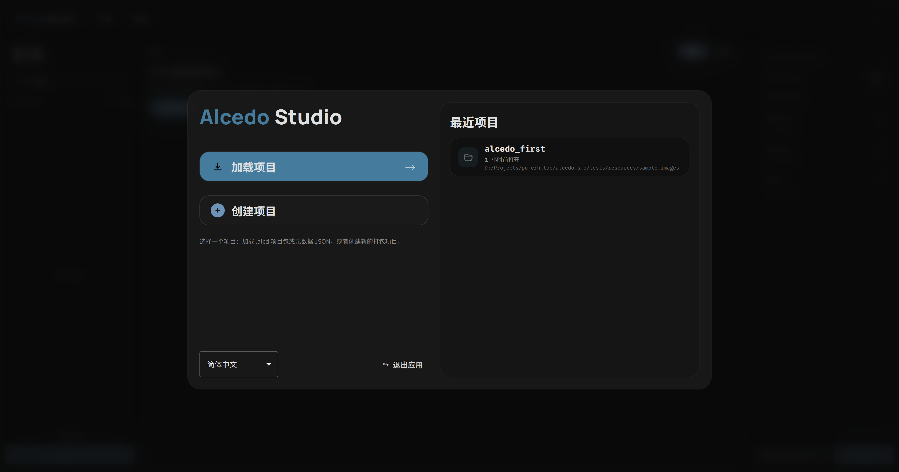
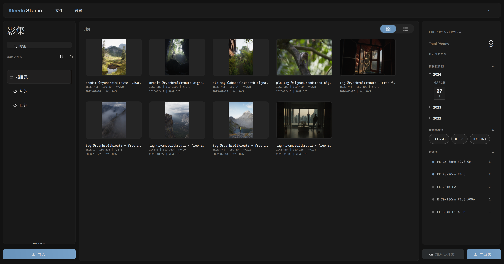
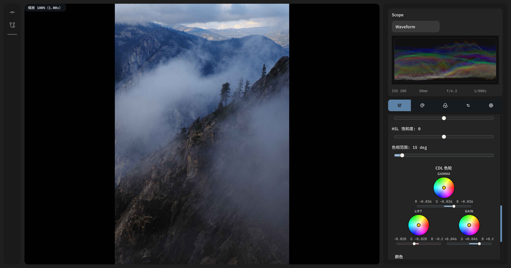
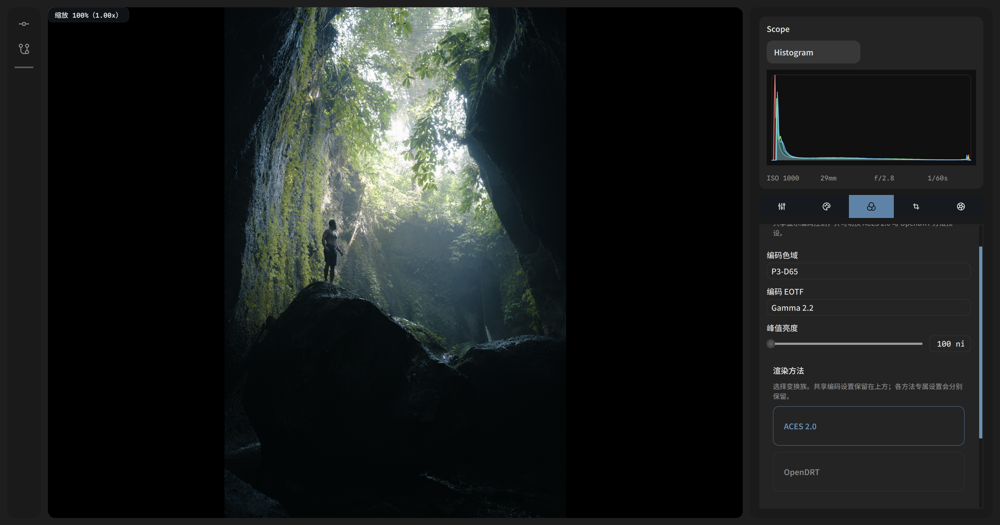
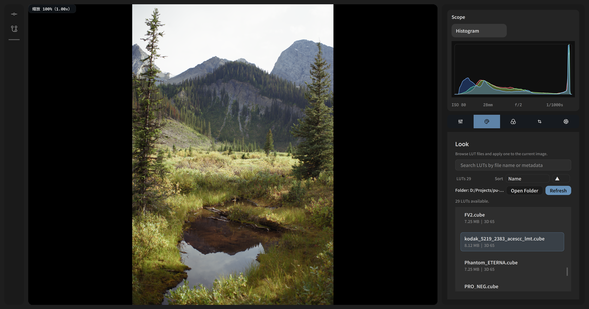
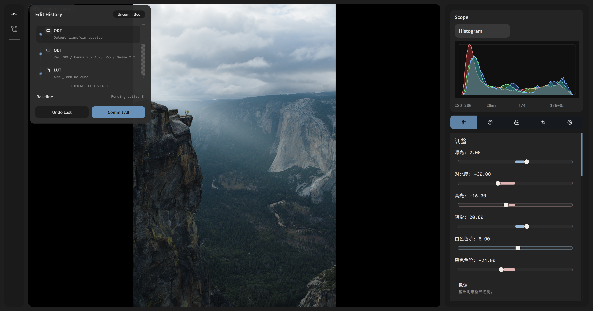
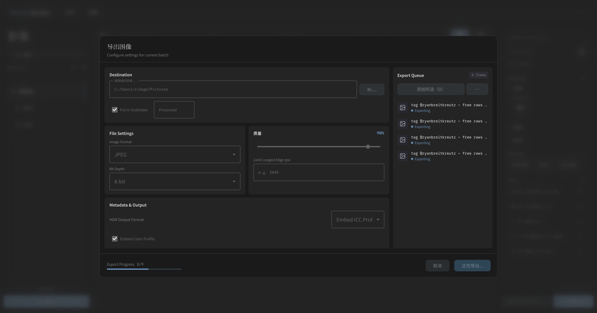

# Alcedo Studio

项目网站：[English](https://zidage.github.io/Alcedo/en/) | [简体中文](https://zidage.github.io/Alcedo/zh/)

<a href="./README.md">English</a> | <a href="./README.zh-CN.md"><strong>简体中文</strong></a>

Alcedo Studio 是一个开源 RAW 图像处理与数字资产管理（DAM）项目，旨在为摄影师提供一个轻量级、高性能、且在很大程度上兼容行业标准的照片编辑与库管理工作流新选择——并内置一层会打标、会搜索、会替你选片的 AI，默认本机跑，云端可选。

> Alcedo Studio _**不是**_ 现有商业软件或其他开源项目的替代品。

## 早期演示

视频演示1：[BiliBili](https://www.bilibili.com/video/BV1bPcxzzEeM)

视频演示2 (带解说)：[BiliBili](https://www.bilibili.com/video/BV1sFfjBeE3n)

<table>
  <colgroup>
    <col style="width: 80%" />
    <col style="width: 20%" />
  </colgroup>
  <tbody>
    <tr>
      <td></td>
      <td>欢迎界面 —— 从统一的品牌入口加载或新建项目</td>
    </tr>
    <tr>
      <td></td>
      <td>影集浏览 —— 文件夹树、响应式缩略图网格，右侧“图库概览”按拍摄日期 / 相机型号 / 镜头聚合</td>
    </tr>
    <tr>
      <td></td>
      <td>HSL 与 CDL Lift / Gain 色轮，搭配实时 Waveform 波形监视器</td>
    </tr>
    <tr>
      <td></td>
      <td>可切换色彩科学 —— ACES 2.0 或 OpenDRT，配合显示色彩空间、EOTF 与峰值亮度控制</td>
    </tr>
    <tr>
      <td></td>
      <td>.cube LUT 库 —— 支持搜索、目录扫描与一键套用</td>
    </tr>
    <tr>
      <td></td>
      <td>可分支的编辑历史 —— 支持撤销、折叠或从任意历史状态分支</td>
    </tr>
    <tr>
      <td></td>
      <td>导出队列 —— 批量导出，支持格式、位深、缩放与元数据选项</td>
    </tr>
  </tbody>
</table>

## AI 原生工作流

你的影库会自己说话。Alcedo Studio 内置两层 AI——**本机端侧视觉引擎**零上云、隐私优先，**可选的远程多模态大模型**负责需要更大脑子的判断。结果是：一个会自己打标、自己评分、还能听懂人话的 RAW 影库。

### 照片会自己给自己打标

内置视觉 sidecar 在你本机跑 CLIP 模型——不要 API key、不上传、照片不出硬盘。MobileCLIP2 和 SigLIP2 自动给每张图打上语义标签，直接写进你的库。随时换模型，旧标签乖乖隔离，切回来还在。

### 别再按文件名搜了，按感觉搜

输入“海边黄昏人像”回车——你的查询被转成向量，在库里的向量索引上做近邻排序，不用翻几千张缩略图，也不用猜它在哪个文件夹。直接的标签、EXIF 查询还是走瞬时的老路径；只有真的“说不清但我就想找”的时候，AI 才会被叫起来。全程本机，隐私优先。

### 一个会写星标的 AI 评委

想听点第二意见？圈选你的候选片，远程视觉大模型回你一段说明、可搜索的标签，外加 1–5 星审美评分和理由——直接写回 EXIF，于是评分哪儿都看得到：星标 UI、统计、缩略图卡片。OpenAI 兼容、Anthropic、火山方舟豆包，或者你自己的端点，随便接。API key 只待在 OS 钥匙串里——绝不进日志、参数或项目文件。评委不一定都和气，挑个人设吧：Lite / Normal / High / xHigh / Max——水 / 普通 / 大师 / 老法师 / 懂哥——从宽容到挑剔。

### 长任务，不打扰你

整库打标、给候选片跑大模型、下载模型——全都作为可取消的后台任务跑，带进度条和弹出面板。交互策略锁挡住那些会搞乱状态的中途操作，AI 在后台干活，你继续修图。

## 核心技术特性

### 高性能核心

- CUDA 加速的图像处理管线，有着当前业界领先的实时预览分辨率，能在现代 GPU 上以 60 FPS 流畅处理大尺寸 RAW 文件（例如 45MP）。
- 精细调整的内存管理与缓存策略，优化庞大影像库浏览时的内存使用，平均 DRAM 占用约 767MB（浏览包含 786 张 42MP RAW 文件的库）同时实现流畅滚动和即时预览生成。
- 使用现代 C++20 编写，注重代码质量、模块化和可维护性（估计是个长期老大难问题）。

### 专业图像处理流水线

- 32位浮点图像处理管线。
- 支持ACES 2.0 的”输出渲染（Output Rendering）“色彩管理体系。
- 负片般的高光过渡算法，适合人像和风光摄影（当然现在还没蒙版，没法让大伙画光）。
- 支持CUBE格式的LUT风格化调色，但需要是ACEScc->ACEScc的LUT。
- 支持带元数据写回的 JPEG/TIFF/PNG/EXR 输出。
- 基于OpenImageIO/Exiv2的影像元数据处理。
- 计划未来支持 HDR 工作流和输出（方便大家发小红书）。

### 可分支、内容寻址的编辑历史

每张照片自带一棵版本树。每个 **Version** 是一个命名的“样子”，有自己独立的撤销/重做时间线，而且都从这张照片的导入基线重放——不是从一个版本派生出另一个——所以你分支一个样子、原版继续改，两者互不干扰。切换激活版本即可 A/B 对比，或把整段历史克隆到另一张图上，跨整组拍摄复用同一套修图配方。

- 撤销/重做只是在一条有序编辑日志里挪动游标——日志是唯一真相，渲染结果只是缓存。
- 新建一个命名版本就是开分支；可重命名、可删除（导入基线删不掉），切换激活版本来左右对比。
- 每个版本都是内容寻址的：对有序编辑和游标做 Merkle 树根哈希，两段一模一样的编辑时间线哈希必然相同。

### 资产管理（Sleeve 系统）

- 简单但灵活的inode式内置文件系统，基于数据库存储，支持文件夹和文件的层级结构。
- 简单精炼的项目文件，仅需一个 `.alcd` 文件即可保存整个项目的状态（包括库结构、每张照片的编辑历史和版本信息等），方便迁移和备份。
- 高级搜索与过滤——按文件名、拍摄日期、相机、镜头、曝光参数组合检索，外加 AI 语义搜索与自动打标，让影库变成一个你能直接对话的东西（详见 [AI 原生工作流](#ai-原生工作流)）。

## RAW 与相机支持

Alcedo Studio 通过补丁版 [LibRaw](https://github.com/zidage/LibRaw) 分支导入主流 RAW 格式：

- Canon CR2 / CR3
- Nikon NEF
- Sony ARW
- Fujifilm RAF
- Panasonic RW2
- Olympus / OM System ORF
- Leica、Hasselblad、Phase One、Pentax、Sigma、Samsung
- DNG，包括手机和无人机的 DNG

完整格式列表见 [docs/supported_raw_formats.md](docs/supported_raw_formats.md)，相机列表见 [docs/supported_cameras.md](docs/supported_cameras.md)。

### 独家支持：Nikon HE / HE\* NEF

Nikon 高效率压缩 (`HE`) 与高效率压缩* (`HE*`) NEF 在官方 LibRaw 0.22 中仍未支持。Alcedo Studio 内置的 LibRaw 分支可直接解码这些文件，无需转换至 DNG。已验证机型包括：

- Nikon Z 8
- Nikon Z 9
- Nikon Z 6 III
- Nikon Z 50 II

解码器实现位于项目 LibRaw 分支：**https://github.com/zidage/LibRaw**

## 系统要求

- Windows 10/11 x64：当前完整 CUDA/OpenGL 编辑器构建目标平台。
- macOS：当前提供面向 Apple 平台的 Metal 后端 Qt 主应用构建；现有 preset 会关闭传统 OpenGL 编辑器，但保留 Apple 原生图像处理后端。
- Windows/CUDA 构建建议使用支持 CUDA 的 NVIDIA GPU（最低计算能力 6.0，即 10 系列或更高；推荐 7.0+，即 20 系列或更高），并尽量配备 6GB+ VRAM 以流畅处理高分辨率 RAW 文件（40MP+）。
- macOS/Metal 构建需要支持 Metal 的 Mac 硬件。
- 至少 8GB 系统内存（建议 16GB+ 以获得更大的库和更流畅的性能）。
- 500MB 可用磁盘空间用于安装和临时工作文件。
- 60MB+ 用于安装包和部分更新支持。

## 源码构建

构建说明（中英对照）单独维护在 [docs/build_from_source.md](docs/build_from_source.md)。

## 路线图

开发里程碑见：

- [docs/roadmap/roadmap.md](docs/roadmap/roadmap.md)

## 许可证

`v0.1.1` tag 及之前的发布版本继续遵循 Apache-2.0。
`v0.1.1` 之后的开发版本遵循 `GPL-3.0-only`，并在根 `LICENSE` 中附带一个基于 GPLv3 第 7 节、用于组合/分发必需 NVIDIA CUDA 组件的补充许可。
详见 [LICENSE](LICENSE) 与 [NOTICE](NOTICE)。

